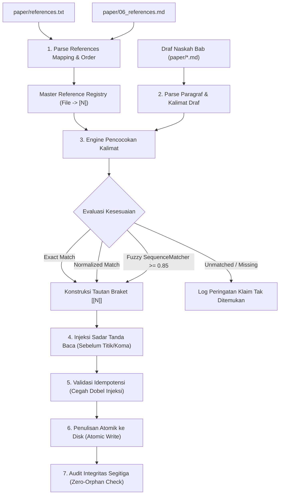

# Alur Kerja Penomoran & Penautan Sitasi Teks (Citation Numbering Workflow)

Dokumen ini merupakan panduan arsitektur operasional **Step 4** dalam alur penulisan manuskrip akademik. Bertugas menyuntikkan (*inject*), menomori, dan menautkan nomor sitasi braket interaktif markdown `[[N]](06_references.md#refN)` ke dalam berkas-berkas draf bab naskah (`paper/*.md`) berdasarkan berkas pemetaan `paper/references.txt` dan daftar pustaka akhir `paper/06_references.md`.

---

## 1. Posisi Step 4 dalam Siklus Hidup Manuskrip

Alur komprehensif penerbitan naskah terdiri dari 6 langkah berkesinambungan:

```
Step 0: ar-paper-outline         -> Blueprint struktur naskah per paragraf
Step 1: ar-paper-draft           -> Penulisan draf naskah per bab (tanpa nomor sitasi)
Step 2: ar-sentence-citation     -> Kurasi sitasi per kalimat -> paper/references.txt & paper/references/*.bib
Step 3: ar-reference-compiler    -> Kompilasi daftar pustaka -> paper/06_references.md
Step 4: ar-citation-numbering    -> Injeksi tautan braket [[N]](06_references.md#refN) ke draf bab
Step 5: ar-paper-abstract        -> Penyusunan abstrak dwibahasa naskah final 00_abstract.md
```

> [!IMPORTANT]
> **Fokus & Batasan Step 4**
> Step 4 **HANYA** menambahkan nomor sitasi braket dan tautan jangkar ke dalam teks draf yang sudah ditulis pada Step 1. Step 4 **TIDAK** menulis ulang narasi kalimat, **TIDAK** mencari referensi baru dari web, dan **TIDAK** mengubah isi entri bibliografi pada `paper/06_references.md`.

---

## 2. Diagram Alir Eksekusi Penomoran Sitasi



---

## 3. Rincian 6 Tahap Siklus Penomoran

### Tahap 1: Registrasi Master Rujukan (*Master Reference Registry*)
- Membaca berkas `paper/references.txt` secara hierarkis.
- Mengidentifikasi setiap berkas catatan bibliografi unik (`.bib`, `.ris`, `.nbib`) berdasarkan urutan kemunculan pertamanya (*Order of First Appearance*).
- Memetakan setiap path berkas rujukan ke indeks integer $N = 1, 2, 3, \dots, K$.
- Melakukan verifikasi silang terhadap tag `<a id="refN"></a>\n[N]` pada `paper/06_references.md` untuk menjamin konsistensi nomor rujukan.

### Tahap 2: Pembongkaran Paragraf Draf Bab
- Membaca berkas bab naskah (`01_introduction.md`, `02_related-works.md`, `03_materials-and-methods_*.md`, `04_results-and-discussion_*.md`, `05_conclusion.md`).
- Memecah dokumen menjadi blok-blok paragraf menggunakan pemisah baris ganda `\n\n`.
- Melindungi elemen non-narasi seperti heading `#`, blok kode ` ``` `, dan baris format tabel `|`.

### Tahap 3: Engine Pencocokan Kalimat Multi-Lapis
- **Lapis 1 (Exact Match):** Mencari substring teks klaim persis di dalam paragraf.
- **Lapis 2 (Normalized Match):** Mengabaikan perbedaan variasi kutip tunggal/ganda (`“`, `”`, `'`), spasi ganda, dan tanda baca penutup klaim.
- **Lapis 3 (Fuzzy Match):** Menggunakan modul `difflib.SequenceMatcher` dengan ambang batas kemiripan $\ge 0.85$ untuk mengakomodasi penyesuaian redaksional minor pada kalimat draf.

### Tahap 4: Format & Konstruksi Tautan Braket
- Mengubah daftar path rujukan pada kalimat klaim menjadi daftar nomor $[N_1, N_2, \dots]$.
- Melakukan deduplikasi dan pengurutan nomor secara menaik (*ascending order*).
- Menghasilkan representasi tautan markdown:
  - Sitasi tunggal: `[[1]](06_references.md#ref1)`
  - Multi-sitasi terpisah: `[[1]](06_references.md#ref1), [[2]](06_references.md#ref2)`

### Tahap 5: Injeksi Sadar Tanda Baca & Idempotensi
- **Posisi Tanda Baca:** Nomor sitasi disuntikkan persis di ujung kata terakhir klaim, dipisahkan satu spasi, dan diletakkan **SEBELUM** tanda baca penutup kalimat (`.`, `,`, `;`, atau `|`).
- **Idempotensi:** Jika kalimat sudah memuat sitasi yang sama persis, proses tidak akan melakukan perubahan (aman dijalankan berulang kali).
- **Mode Pembersihan (`--strip`):** Menyediakan kemampuan membersihkan seluruh sitasi jika pengguna ingin mengembalikan draf ke format teks polos atau melakukan penomoran ulang dari nol.

### Tahap 6: Verifikasi Kepatuhan & Audit Integritas
- Menjalankan audit dua arah (*bidirectional zero-orphan check*):
  1. Memastikan seluruh `[[N]]` di naskah bab memiliki entri yang sah di `06_references.md`.
  2. Memastikan seluruh entri di `06_references.md` disitir minimal satu kali di dalam bab naskah.
  3. Memeriksa ketiadaan sitasi yang diletakkan setelah tanda baca titik (`. [[1]]`).
