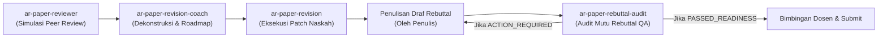

# Panduan Skill: ar-paper-rebuttal-audit

Skill ini mengatur audit penjaminan mutu independen (*advisory QA gate*) terhadap draf surat tanggapan reviewer (*rebuttal letter* / *point-by-point response to reviewers*) sebelum diajukan ke pembimbing atau portal jurnal (Fase 23 / Kluster F siklus riset akademik).

---

## 1. Aturan Mutlak (*Iron Rules*)

1. **Gerbang Masukan Ganda (*Dual-Document Input Gate*)**:
   - Audit **wajib** menerima dua dokumen: (1) Berkas komentar reviewer mentah/terstruktur, dan (2) Draf surat tanggapan yang telah disusun penulis.
   - Jika draf tanggapan belum ada, tolak audit dan arahkan pengguna untuk menyusun draf awal terlebih dahulu (atau gunakan `ar-paper-revision-coach` untuk membuat *response skeleton*).
2. **Aturan Tanpa-Yatim (*Zero-Orphan Coverage Rule*)**:
   - Setiap butir komentar reviewer wajib memiliki tanggapan berpasangan (*1-to-1 mapping*). Tidak boleh ada komentar kritis yang diabaikan atau disapu ke bawah karpet.
3. **Diplomasi Nada & Anti-Sycophancy (*Tone & Diplomacy Rule*)**:
   - Larangan keras nada defensif, sarkastik, agresif (*combative*), atau menghindar (*evasive*).
   - Larangan pujian berlebihan yang tidak tulus (*sycophantic flattery*). Gunakan pola objektif **AVEC** (*Acknowledge $\to$ Validate $\to$ Evidence $\to$ Clarify*).
4. **Jangkar Bukti Presisi (*Evidence Grounding & Locators*)**:
   - Setiap klaim perbaikan wajib menyertakan bukti lokasi naskah: Bagian/Subbab (*Section*), Halaman (*Page*), Tabel/Gambar, Baris, atau Blok ID deterministik (`B0042`).
5. **Justifikasi Penolakan Ilmiah (*Disagreement Justification Rule*)**:
   - Penolakan saran reviewer atau deklarasi batasan riset (*DELIBERATE_LIMITATION* / *REVIEWER_DISAGREE*) wajib disertai alasan metodologis, teoritis, empiris, atau batasan sumber daya yang sah, bukan sekadar opini subjektif.
6. **Batasan Integritas Penasihat (*Advisory Integrity Boundary*)**:
   - Audit bersifat memeriksa dan merekomendasikan (*read-only advisory QA*). Audit **tidak boleh** menulis ulang tanggapan secara diam-diam (*silent rewrites*), tidak menerbitkan Schema 11, dan tidak menerbitkan status `ready_to_submit`.

---

## 2. Empat Dimensi Evaluasi Audit

| Dimensi | Kode | Fokus Pemeriksaan | Ambang Kualitas Minimal |
|:---|:---:|:---|:---|
| **Zero-Orphan Coverage** | `D1` | Seluruh komentar reviewer terjawab tanpa ada yang terlewat | 100% (*0 Missing Items*) |
| **Tone & Academic Diplomacy** | `D2` | Nada profesional, anti-defensif, non-sycophantic, diplomatis | 0 *High-Risk Flags* |
| **Evidence Grounding & Locators** | `D3` | Keberadaan rujukan lokasi naskah (Section, Page, Table, Block ID) | $\ge 70\%$ item terjawab memiliki lokator |
| **Disagreement Justification** | `D4` | Validitas alasan penolakan/batasan berdasarkan bukti ilmiah | 100% penolakan terjustifikasi |

---

## 3. Alur Kerja Eksekusi Audit (4 Tahap)

### Tahap 1: Validasi Masukan & Penjodohan Berkas (*Input Pairing*)
- Muat berkas komentar reviewer (`comments.md` atau `07_editorial_decision.md`) dan draf tanggapan (`response.md` atau bab tanggapan).
- Ekstrak seluruh butir komentar reviewer menjadi ID unik (`R1-1`, `R1-2`, `REV-001`, dsb.).
- Ekstrak seluruh butir respons penulis dan petakan (*match*) terhadap komentar reviewer.

### Tahap 2: Evaluasi Deterministik 4 Dimensi
Jalankan skrip mesin audit:
```bash
python scripts/ars_rebuttal_auditor.py --comments <comments_path> --rebuttal <rebuttal_path> --output-report 11_rebuttal_audit_report.md --json-out 11_rebuttal_audit_report.json
```
Mesin audit akan:
1. Menghitung rasio cakupan (*coverage ratio*) dan mendeteksi komentar yatim (*orphan/missing comments*).
2. Memindai leksikon nada berisiko (*combative*, *evasive*, *sycophantic*, *ungrounded*, *unjustified refusal*).
3. Mengekstrak jangkar bukti dan lokator naskah dari kolom `Changes Made` atau teks respons.
4. Menilai kelayakan ilmiah dari butir-butir penolakan (*disagreements*).

### Tahap 3: Verifikasi Integritas QA Linter
Jalankan skrip verifikasi integritas:
```bash
python scripts/verify_rebuttal_integrity.py --report 11_rebuttal_audit_report.json
```
Kriteria Kelulusan Mutu (*Pass Criteria*):
- `missing_count == 0` (Semua komentar terjawab).
- `high_risk_flags == 0` (Nol nada agresif/defensif berisiko tinggi).
- Rasio bukti naskah $\ge 70\%$.

### Tahap 4: Sintesis Laporan & Rekomendasi Tindakan
- Sajikan dokumen `11_rebuttal_audit_report.md` kepada pengguna.
- Berikan poin-poin perbaikan konkret sebelum naskah dibawa ke sesi bimbingan dosen pembimbing.

---

## 4. Taksonomi Status Kesiapan (*Readiness Verdicts*)

1. **`PASSED_READINESS` (Siap Diajukan / Siap Bimbingan)**:
   - 100% komentar terjawab (`coverage_ratio == 1.0`).
   - 0 bendera risiko tinggi (*high risk*), $\le 1$ bendera sedang (*medium risk*).
   - Seluruh penolakan terjustifikasi kuat dengan lokator naskah memadai.
2. **`ACTION_REQUIRED` (Perlu Perbaikan Kritis)**:
   - Terdapat komentar terlewat (*orphan/missing*).
   - Ditemukan nada defensif/agresif (*combative*) atau penolakan tanpa justifikasi (*unjustified refusal*).
   - Rasio keberadaan lokator naskah $< 70\%$.

---

## 5. Hubungan dengan Skill Lain dalam Siklus Riset



---

## 6. Referensi Pendukung (*References Guide*)

Saat memerlukan panduan mendalam untuk audit tertentu, buka berkas panduan di direktori `references/`:
- [rebuttal_audit_framework.md](file:///D:/Code/docs-and-skills/skills/ar-paper-rebuttal-audit/references/rebuttal_audit_framework.md): Landasan teori, 4 dimensi audit, taksonomi status kesiapan, dan batasan integritas.
- [tone_and_diplomacy_playbook.md](file:///D:/Code/docs-and-skills/skills/ar-paper-rebuttal-audit/references/tone_and_diplomacy_playbook.md): Pola diplomasi akademik AVEC, leksikon kata berisiko, dan transformasi nada defensif ke nada konstruktif.
- [evidence_grounding_and_locators_guide.md](file:///D:/Code/docs-and-skills/skills/ar-paper-rebuttal-audit/references/evidence_grounding_and_locators_guide.md): Hierarki 4 lapis lokator naskah, format Block ID (`B0042`), dan integrasi bukti revisi.
- [disagreement_and_limitations_handbook.md](file:///D:/Code/docs-and-skills/skills/ar-paper-rebuttal-audit/references/disagreement_and_limitations_handbook.md): Panduan menolak saran reviewer secara santun, 3 standar justifikasi ilmiah, dan taksonomi status penolakan.
- [sample_rebuttal_audit_package.md](file:///D:/Code/docs-and-skills/skills/ar-paper-rebuttal-audit/references/sample_rebuttal_audit_package.md): Contoh lengkap masukan, draf bermasalah, laporan audit QA yang dihasilkan, dan draf final yang disempurnakan.
