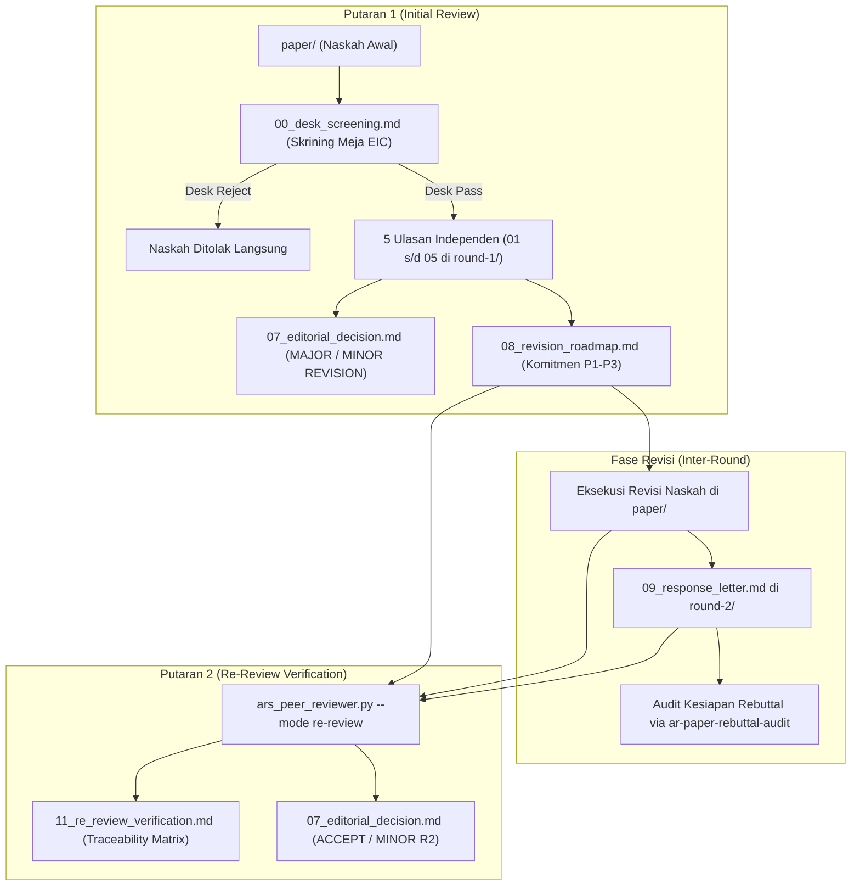

# Academic Paper Reviewer (`ar-paper-reviewer`)

Keterampilan simulasi panel peer review akademik independen berstandar internasional untuk membedah, menguji, dan mengaudit naskah paper ilmiah sebelum diajukan ke dosen pembimbing (*Pre-Advising Sparring Partner*) atau dikirimkan ke portal jurnal/konferensi bereputasi, mendukung siklus multi-putaran (*multi-round review* & *re-review verification*).

---

## 1. Kapan Mengaktifkan & Kapan TIDAK Mengaktifkan

### Kapan Mengaktifkan:
- Pengguna meminta review naskah lengkap, mock peer review, evaluasi kritis pra-submit, atau pengujian kelayakan naskah.
- Pengguna meminta penelaahan awal meja editor (*Desk Screening / Review Awal*).
- Pengguna meminta pengujian argumen inti secara adversarial (*Devil's Advocate challenge*).
- Pengguna meminta verifikasi putaran kedua (*Round 2 Re-Review*) untuk menguji apakah revisi naskah telah memenuhi komitmen *Revision Roadmap*.
- Pengguna meminta audit keterlacakan pemenuhan komitmen (*R&R Traceability Matrix*).
- Kata kunci pemicu: `review paper`, `peer review`, `mock review`, `simulasi review`, `audit naskah`, `cek kelayakan submit`, `telaah paper`, `devil's advocate review`, `re-review`, `verifikasi revisi`, `review round 2`, `paper_reviews`, `/ars-reviewer`.

### Kapan TIDAK Mengaktifkan:
- Menulis draf bab naskah dari outline $\rightarrow$ Gunakan **`ar-paper-draft`**.
- Merancang struktur bab dan alokasi kata $\rightarrow$ Gunakan **`ar-paper-outline`**.
- Mencari sitasi dan menyusun pemetaan kalimat $\rightarrow$ Gunakan **`ar-paper-sentence-citation`**.
- Mengompilasi naskah daftar pustaka akhir `06_references.md` $\rightarrow$ Gunakan **`ar-paper-reference-compiler`**.
- Menginjeksi penomoran sitasi braket `[[N]]` ke dalam bab naskah $\rightarrow$ Gunakan **`ar-paper-citation-numbering`**.
- Menyusun abstrak dwibahasa dan kata kunci $\rightarrow$ Gunakan **`ar-paper-abstract`**.

---

## 2. Arsitektur Multi-Putaran & Konsep "Review Awal"

Proses penelaahan akademik beroperasi dalam dua mode utama dengan prinsip kesinambungan tolok ukur (*Yardstick Continuity*):



### A. Review Awal (Desk Screening EIC)
Sebelum penilai luar diundang, EIC melakukan penyaringan awal (`00_desk_screening.md`):
1. **Scope & Venue Fit**: Kesesuaian topik dengan fokus jurnal target.
2. **Format & Structure Hygiene**: Kelengkapan bab IMRaD, angka pada temuan abstrak, dan daftar pustaka.
3. **Penyaringan Cacat Fatal Dini**: Mendeteksi data leakage atau plagiasi tinggi.
- Opsi Keputusan: **`DESK_REJECT`** (proses berhenti) atau **`DESK_PASS`** (maju ke penelaahan 5 panelis).

### B. 5 Persona Penilai Independen (Round 1)
| Peran Reviewer | Fokus Utama | Tanggung Jawab Spesifik |
|---|---|---|
| **Editor-in-Chief (EIC)** | *Venue Fit & Contribution* (`D6`) | Kesesuaian scope target, signifikansi kebaruan (*novelty*), dan struktur eksposisi umum (`D5`). |
| **Reviewer 1 (Methodology)** | *Methodology Rigor* (`D1`) | Desain eksperimen, validitas partisi data (*patient-level split*), uji DeLong, CI 95%, dan pencegahan *data leakage*. |
| **Reviewer 2 (Domain Expert)** | *Domain Accuracy* (`D2`) | Ketepatan terminologi teknis/medis, cakupan literatur primer, dan perbandingan berimbang baseline SOTA. |
| **Reviewer 3 (Cross-Perspective)** | *Cross-Disciplinary Relevance* (`D4`) | Keterbacaan lintas disiplin, potensi adopsi praktis, estimasi latensi inferensi, dan etika data (IRB). |
| **Devil's Advocate (DA)** | *Argumentative Coherence* (`D3`) | Penantang argumen inti, pendeteksi *cherry-picking*, *confirmation bias*, dan uji *"So What?"*. |

### C. Putaran Kedua: Re-Review (Verification Review)
- Menggunakan profil panel yang dibekukan (*Yardstick Freeze*) pada `panel_config.json`.
- Memverifikasi setiap butir roadmap: `FULLY_ADDRESSED`, `PARTIALLY_ADDRESSED`, atau `NOT_ADDRESSED`.
- Menghasilkan matriks ketertelusuran `11_re_review_verification.md` dan keputusan baru `07_editorial_decision.md`.

---

## 3. Standar Struktur Folder: `paper_reviews/`

Untuk menjaga kebersihan bab naskah di `paper/` dan mencegah penimpaan berkas (*zero overwrite*), seluruh artefak penelaahan dikelola di bawah direktori `paper_reviews/`:

```text
paper_reviews/
├── REVIEW_LOG.md                           # Log riwayat status ulasan lintas putaran
│
├── round-1/                                # === PUTARAN 1: INITIAL REVIEW ===
│   ├── panel_config.json                   # Profil kepakaran 5 penilai (Yardstick Freeze)
│   ├── 00_desk_screening.md                # [Review Awal] Skrining Meja EIC (Desk Pass vs Reject)
│   ├── 01_eic_report.md                    # Laporan ulasan Editor-in-Chief
│   ├── 02_methodology_report.md            # Laporan ulasan Reviewer 1 (Metodologi)
│   ├── 03_domain_report.md                 # Laporan ulasan Reviewer 2 (Domain SOTA)
│   ├── 04_cross_perspective_report.md      # Laporan ulasan Reviewer 3 (Etika & Klinis)
│   ├── 05_devils_advocate_report.md        # Laporan ulasan Devil's Advocate
│   ├── 06_findings_database.json           # Kompilasi terstruktur temuan reviewer
│   ├── 07_editorial_decision.md            # Surat Keputusan EIC R1 (MAJOR / MINOR REVISION)
│   └── 08_revision_roadmap.md              # Matriks Komitmen Perbaikan R1 (P1, P2, P3)
│
└── round-2/                                # === PUTARAN 2: RE-REVIEW (VERIFIKASI) ===
    ├── 09_response_letter.md               # Surat Tanggapan Penulis (Point-by-Point Rebuttal)
    ├── 10_rebuttal_audit_report.md         # Laporan Audit Diplomasi Nada & Lokator Bukti
    ├── 11_re_review_verification.md        # R&R Traceability Matrix (Verifikasi Teks Naskah)
    ├── 12_eic_re_review_notes.md           # Catatan Evaluasi Verifikasi EIC
    └── 07_editorial_decision.md            # Surat Keputusan EIC R2 (Status: ACCEPT)
```

---

## 4. Mesin Keputusan: Schema 13 (Round 1) & Verifikasi (Round 2)

### A. Keputusan Putaran Pertama (Schema 13 Deterministik F0–F5):
- **F1 (REJECT)**: Salah satu dimensi Mandatory (`D1, D2, D3, D6`) berstatus `fatal`.
- **F2, F3, F4 (MAJOR REVISION)**: Dimensi Mandatory berstatus `block`, atau $\ge 2$ dimensi berstatus $\ge$ `warn`, atau `D4` berstatus `block`. Tenggat perbaikan: 6–8 minggu.
- **F5 (MINOR REVISION)**: Minimal 1 dimensi berstatus $\ge$ `warn` tanpa status block/fatal. Tenggat: 2–3 minggu.
- **F0 (ACCEPT)**: Seluruh dimensi `pass` dan tidak ada DA CRITICAL terbuka.

### B. Keputusan Putaran Kedua (Re-Review Verification):
- **ACCEPT**: Seluruh komitmen **Priority 1 (Must Fix)** berstatus `FULLY_ADDRESSED`, $\ge 80\%$ item **Priority 2 (Should Fix)** berstatus `FULLY_ADDRESSED`, dan bebas cacat baru.
- **MINOR REVISION (Round 2)**: Seluruh isu Priority 1 tuntas, namun masih ada 1–2 catatan kecil Priority 2/3 yang perlu perbaikan narasi/tabel akhir (tenggat: 1 minggu).
- **MAJOR REVISION (Round 2)**: Terdapat isu Priority 1 yang masih berstatus `PARTIALLY_ADDRESSED` atau membutuhkan data eksperimen lanjutan.
- **REJECT**: Penulis menolak memperbaiki isu Priority 1 tanpa alasan ilmiah valid (*unjustified refusal*).

---

## 5. Aturan Emas Integritas Review (Iron Rules)

1. **Read-Only Constraint Mutlak**: Penilai **DILARANG KERAS** menyunting bab naskah (`paper/*.md`). Reviewer memeriksa naskah, bukan menulis naskah.
2. **Isolasi Antar-Penilai (Zero Contamination)**: 5 penilai bekerja secara independen tanpa saling membaca ulasan sebelum disintesis oleh EIC.
3. **Yardstick Continuity**: Profil penilai yang dibekukan di `panel_config.json` Round 1 wajib dipakai ulang di Round 2 agar kriteria penilaian tidak bergeser secara sepihak.
4. **Adjudikasi DA CRITICAL**: Isu kritis Devil's Advocate wajib diadjudikasi eksplisit oleh EIC (`VALIDATED`, `REJECTED` berdasar, atau `UNRESOLVED` yang membekukan Accept).
5. **Kewajiban Typed Evidence Anchors**: Setiap temuan wajib menyertakan jangkar bukti (`[section: ...]`, `[table: ...]`, `[figure: ...]`, `[equation: ...]`, `[text: ...]`, `[dataset: ...]`).

---

## 6. Penggunaan Skrip Pembantu CLI

### A. Putaran 1: Sintesis Peer Review Panel Penuh (`ars_peer_reviewer.py --mode full`)
```bash
# Memproses berkas ulasan putaran 1 dan menghasilkan keputusan serta roadmap di paper_reviews/round-1/
python skills/ar-paper-reviewer/scripts/ars_peer_reviewer.py \
  --mode full \
  --round 1 \
  --input paper_reviews/round-1/ \
  --output-dir paper_reviews/round-1/

# Simulasi evaluasi putaran 1 tanpa menulis berkas ke disk (dry-run)
python skills/ar-paper-reviewer/scripts/ars_peer_reviewer.py --mode full --round 1 --input paper_reviews/round-1/ --dry-run
```

### B. Putaran 2: Verifikasi Re-Review (`ars_peer_reviewer.py --mode re-review`)
```bash
# Memverifikasi pemenuhan komitmen roadmap R1 terhadap naskah baru dan response letter R2
python skills/ar-paper-reviewer/scripts/ars_peer_reviewer.py \
  --mode re-review \
  --round 2 \
  --roadmap paper_reviews/round-1/08_revision_roadmap.md \
  --response paper_reviews/round-2/09_response_letter.md \
  --paper-dir paper/ \
  --output-dir paper_reviews/round-2/

# Evaluasi re-review format JSON ke konsol
python skills/ar-paper-reviewer/scripts/ars_peer_reviewer.py \
  --mode re-review \
  --round 2 \
  --roadmap paper_reviews/round-1/08_revision_roadmap.md \
  --response paper_reviews/round-2/09_response_letter.md \
  --json
```

### C. Audit Integritas Ulasan (`verify_reviewer_integrity.py`)
```bash
# Memverifikasi kepatuhan batasan read-only, persona, dan evidence anchor pada ulasan
python skills/ar-paper-reviewer/scripts/verify_reviewer_integrity.py \
  --input paper_reviews/round-1/ \
  --paper-dir paper/
```

---

## 7. Daftar Berkas Referensi

| Berkas Referensi | Deskripsi & Kegunaan |
|---|---|
| [`multi_round_and_re_review_protocol.md`](references/multi_round_and_re_review_protocol.md) | Protokol lengkap penelaahan multi-round, skrining meja editor, yardstick freeze, dan matriks verifikasi re-review. |
| [`peer_review_panel_architecture.md`](references/peer_review_panel_architecture.md) | Arsitektur 5 persona penilai, isolasi kanal ulasan, demarkasi R3/DA, data fences, dan dissent protocol. |
| [`sprint_contract_schema13_protocol.md`](references/sprint_contract_schema13_protocol.md) | Spesifikasi formal 6 dimensi akseptasi (D1–D6), eligible roles, aturan keputusan F0–F5, dan Decision Symmetry (#574 B1). |
| [`devils_advocate_adversarial_guide.md`](references/devils_advocate_adversarial_guide.md) | Pedoman pengujian adversarial, 4 kriteria Critical, Field-Norm calibration, tabel C1..Cn, dan anti-sycophancy. |
| [`review_criteria_and_quality_rubrics.md`](references/review_criteria_and_quality_rubrics.md) | Rubrik mutu 0–100 kanonikal, rubrik D1-D6 lengkap, standar statistik APA 7, dan checklist deteksi dini cacat fatal. |
| [`editorial_synthesis_and_roadmap_guide.md`](references/editorial_synthesis_and_roadmap_guide.md) | Panduan konsolidasi ulasan, adjudikasi sengketa DA, Top Blocking Issues, dan Acceptance Criteria roadmap. |
| [`sample_peer_review_package.md`](references/sample_peer_review_package.md) | Contoh nyata paket ulasan lengkap: laporan 5 reviewer, surat keputusan EIC dengan 4 audit lines, dan roadmap perbaikan. |
