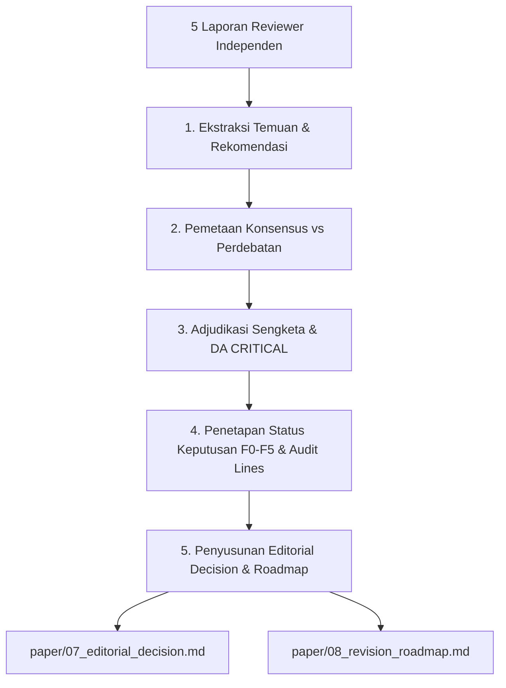

# Panduan Sintesis Editorial & Penyusunan Revision Roadmap

Dokumen ini memandu proses konsolidasi laporan ulasan dari kelima penilai independen menjadi Surat Keputusan Editorial resmi (`07_editorial_decision.md`) dan Dokumen Kerja Rencana Aksi Revisi Berbasis Kriteria Keterterimaan (`08_revision_roadmap.md`).

---

## 1. Alur Kerja Sintesis Editorial 5 Tahap



### Langkah 1: Ekstraksi Temuan & Rekomendasi
- Mengumpulkan seluruh rekomendasi formal dari kelima peran (EIC, Methodology, Domain, Perspective, Devil's Advocate).
- Mengekstrak setiap temuan kelemahan beserta atributnya: Judul Isu, Dimensi Terkait (D1–D6), Bukti Lokasi Naskah (*Evidence Anchor*), dan Tingkat Keparahan (*Severity: CRITICAL / MAJOR / MINOR*).

### Langkah 2: Pemetaan Konsensus vs Perdebatan (*Consensus vs Disagreement*)
- **Konsensus Penuh (`[CONSENSUS-4]`)**: Seluruh reviewer non-DA sepakat mengenai kebutuhan perbaikan (misal: penambahan uji scanner eksternal). Isu ini otomatis masuk ke Priority 1.
- **Konsensus Mayoritas (`[CONSENSUS-3]`)**: Tiga penilai sepakat, satu penilai tidak menyebutkan.
- **Perdebatan / Terbelah (`[SPLIT]`)**: Terdapat silang pendapat atau rekomendasi yang saling bertentangan. EIC bertindak sebagai arbiter penengah.

### Langkah 3: Adjudikasi Sengketa & Verifikasi DA CRITICAL
- Editor-in-Chief menguji setiap keberatan kritis dari Devil's Advocate (`C1..Cn`).
- **Status Tripartit Adjudikasi**:
  - `VALIDATED`: Keberatan DA diakui sah $\rightarrow$ Wajib masuk Top Blocking Issues dan memblokir *Accept*.
  - `REJECTED`: Keberatan DA ditolak oleh EIC disertai justifikasi rasional ilmiah $\rightarrow$ Tidak menghalangi keputusan *Accept*.
  - `UNRESOLVED`: Isu belum terselesaikan atau membutuhkan pengujian empiris $\rightarrow$ Wajib diselesaikan pada putaran revisi.
- **Aturan Anti-Silent Accept**: Penanda `[DA-CRITICAL-VS-ACCEPT: <n> validated/unresolved]` disematkan bila keputusan mekanis adalah `ACCEPT` namun masih terdapat isu DA kritis terbuka.

### Langkah 4: Evaluasi Kondisi Kontrak Sprint (F0 – F5) & Baris Audit
- Menghitung status agregat per dimensi D1–D6.
- Menghasilkan 4 baris audit sintesis kanonikal:
  ```text
  dimension_verdicts: [D1=..., D2=..., D3=..., D4=..., D5=..., D6=...]
  fired_conditions: [F...]
  da_critical_adjudications: [C1=VALIDATED|REJECTED|UNRESOLVED, ...]
  editorial_decision=accept|minor_revision|major_revision|reject
  ```

### Langkah 5: Penerbitan Paket Luaran Resmi
- Menghasilkan berkas `paper/07_editorial_decision.md` dan `paper/08_revision_roadmap.md`.

---

## 2. Struktur Standar `07_editorial_decision.md`

Surat keputusan editorial memuat komponen kanonikal:
1. **Header & Baris Audit Kanonikal**: Pinned audit lines untuk parser dan mesin CI/CD.
2. **Ringkasan Rekomendasi Panel**: Tabel komparasi rekomendasi kelima reviewer mandiri.
3. **Status 6 Dimensi Akseptasi (Schema 13)**: Status kelulusan per dimensi (`pass`, `warn`, `block`, `fatal`), prioritas, eligible roles, dan nomor kondisi aturan yang terpicu.
4. **Top Blocking Issues (Maksimal 3 Isu Pemblokir)**: Rangkuman isu kritis teratas yang menjadi penentu utama kelayakan publikasi.
5. **Catatan Evaluasi Kritis per Dimensi**: Uraian masalah spesifik yang harus diperbaiki penulis.
6. **Instruksi Tindak Lanjut & Batas Waktu Revisi**:
   - *Minor Revision*: Batas waktu pengajuan kembali 2–3 minggu.
   - *Major Revision*: Batas waktu pengajuan kembali 6–8 minggu disertai surat tanggapan poin-demi-poin.

---

## 3. Struktur Standar `08_revision_roadmap.md`

Dokumen *Revision Roadmap* adalah peta kerja terstruktur yang dirancang agar dapat dibaca langsung oleh skill lanjutan (`ar-paper-revision-coach` dan `ar-paper-revision`).

### Format Matriks 8 Kolom:

| ID Isu | Penilai Sumber | Dimensi | Severity | Ringkasan Isu & Lokasi Bukti | Rencana Aksi Perbaikan | Kriteria Keterterimaan (Acceptance Criteria) | Status |
|:---:|:---:|:---:|:---:|---|---|---|:---:|
| `ISSUE-01` | Methodology | `D1` | **`CRITICAL`** | Risiko kebocoran data subjek pada split 5-fold (`[section: 03_methods]`) | Terapkan strictly patient-level grouping split dan latih ulang model | Uji coba cross-validation membuktikan 0% irisan subjek antara train dan test set. | [ ] |
| `ISSUE-02` | Devil's Advocate | `D3` | **`MAJOR`** | Dugaan cherry-picking pada pemilihan metrik F1-score (`[table: 3]`) | Tambahkan kurva Precision-Recall dan uji signifikansi DeLong p-value | Tabel 3 memuat nilai 95% CI dan p-value uji komparasi terhadap seluruh baseline. | [ ] |
| `ISSUE-03` | Domain Expert | `D2` | **`MINOR`** | Belum menyitir paper benchmark ISLES 2024 terkini (`[section: 02_related]`) | Tambahkan referensi pada paragraf 3 dan bandingkan metrik Dice score | Paper disitir secara akurat dan angka komparasi dicantumkan pada tabel tinjauan. | [ ] |

### Pengelompokan Hierarki Prioritas Revisi:
1. **Priority 1: Structural & Critical Revisions (Must Fix - Blocker)**:
   - Isu yang meruntuhkan validitas riset (kebocoran data, metodologi salah, counter-argument DA fatal). Wajib diselesaikan sebelum penyuntingan teks.
2. **Priority 2: Content & Literature Supplementation (Should Fix - Major)**:
   - Eksperimen sensitivitas tambahan, penambahan baseline pembanding SOTA, dan pembatasan generalisasi klaim.
3. **Priority 3: Text, Citations & Minor Formatting (Nice to Fix - Editorial)**:
   - Koreksi tipografi, kelengkapan keterangan gambar/tabel, dan perbaikan gaya penulisan daftar pustaka.
