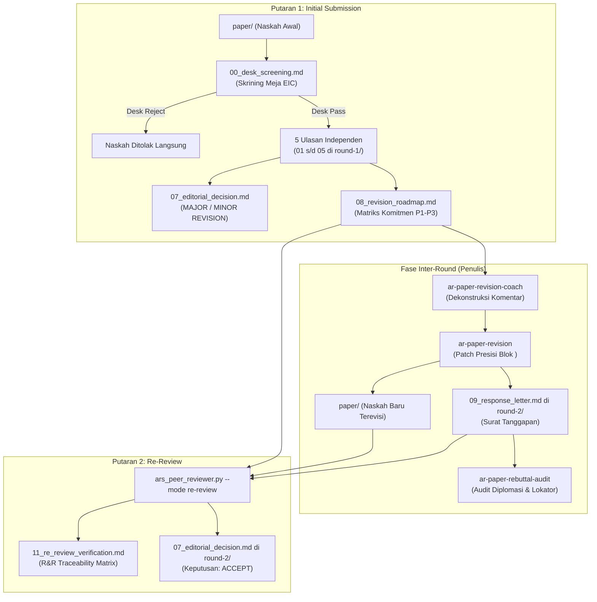

# Protokol Multi-Round Peer Review & Verifikasi Re-Review

Pedoman operasional lengkap untuk mengelola siklus penelaahan naskah ilmiah multi-putaran (*multi-round peer review*), mulai dari skrining awal meja editor (*Desk Screening*), ulasan panel putaran pertama (Round 1), hingga verifikasi perbaikan putaran kedua (Round 2 Re-Review).

---

## 1. Arsitektur Folder Kanonikal: `paper_reviews/`

Seluruh artefak ulasan, keputusan editor, rencana aksi revisi, dan surat sanggahan dipisahkan dari folder naskah `paper/` dan dikelola di bawah folder `paper_reviews/`:

```text
paper_reviews/
├── REVIEW_LOG.md                           # Log riwayat status & tanggal penelaahan lintas putaran
│
├── round-1/                                # === PUTARAN 1: INITIAL PEER REVIEW ===
│   ├── panel_config.json                   # Konfigurasi kepakaran 5 persona penilai (Yardstick Freeze)
│   ├── 00_desk_screening.md                # [Review Awal] Skrining Meja EIC (Desk Pass vs Desk Reject)
│   ├── 01_eic_report.md                    # Ulasan Editor-in-Chief (Venue Fit & Novelty)
│   ├── 02_methodology_report.md            # Ulasan Reviewer 1 (Desain Eksperimen, Data Split, Leakage)
│   ├── 03_domain_report.md                 # Ulasan Reviewer 2 (Akurasi Domain, SOTA Benchmark)
│   ├── 04_cross_perspective_report.md      # Ulasan Reviewer 3 (Etika IRB, Dampak Klinis/Praktis)
│   ├── 05_devils_advocate_report.md        # Ulasan Devil's Advocate (Uji Adversarial Argumen Inti)
│   ├── 06_findings_database.json           # Ekstraksi data temuan terstruktur (Severity & Anchors)
│   ├── 07_editorial_decision.md            # Surat Keputusan EIC R1 (MAJOR / MINOR REVISION)
│   └── 08_revision_roadmap.md              # Matriks Komitmen Perbaikan R1 (P1, P2, P3)
│
├── round-2/                                # === PUTARAN 2: RE-REVIEW (VERIFIKASI PERBAIKAN) ===
│   ├── 09_response_letter.md               # Surat Tanggapan Penulis (Point-by-Point Rebuttal)
│   ├── 10_rebuttal_audit_report.md         # Hasil Audit Diplomasi Nada, Zero-Orphan, & Lokator Bukti
│   ├── 11_re_review_verification.md        # R&R Traceability Matrix (Verifikasi Klaim vs Teks Riil Naskah)
│   ├── 12_eic_re_review_notes.md           # Catatan Evaluasi Verifikasi EIC terhadap Naskah Baru
│   ├── 07_editorial_decision.md            # Surat Keputusan EIC R2 (ACCEPT / MINOR REVISION R2)
│   └── 08_residual_roadmap.md              # (Kondisional: jika masih ada catatan minor residual)
│
└── round-3/                                # (Opsional: Bila Round 2 membutuhkan klarifikasi minor final)
    ├── 09_response_letter_r2.md            # Surat tanggapan atas catatan minor R2
    └── 07_editorial_decision_final.md      # Surat Keputusan Terbit Final (FINAL ACCEPTANCE)
```

---

## 2. Siklus Fase: Dari Review Awal Hingga Re-Review



---

## 3. Protokol Review Awal: Skrining Meja Editor (`00_desk_screening.md`)

Sebelum panel reviewer luar diundang, EIC melakukan penyaringan kelayakan awal (*desk screening*):

1. **4 Kriteria Skrining Awal**:
   - **Kesesuaian Ruang Lingkup (*Scope & Venue Fit*)**: Apakah topik, arsitektur, dan kontribusi artikel relevan dengan pembaca jurnal/konferensi target?
   - **Kepatuhan Format & Kelengkapan (*Format Hygiene*)**: Apakah naskah memuat struktur IMRaD lengkap, abstrak berangka, dan daftar pustaka yang valid?
   - **Integritas Orisinalitas (*Plagiarism & AI Disclosure*)**: Pengecekan kesamaan teks (*text similarity*) dan transparansi penggunaan alat bantu komputasi/AI.
   - **Penyaringan Cacat Fatal Dini (*Fatal Flaw Screening*)**: Apakah terdapat kekurangan yang begitu fundamental (misal: dataset hanya 5 sampel tanpa baseline) yang membuat pengiriman ke penilai luar hanya membuang waktu?

2. **Dua Opsi Keputusan Skrining Meja**:
   - **`DESK_REJECT`**: Naskah ditolak langsung di meja editor. Proses berhenti; tidak ada putaran ulasan panel.
   - **`DESK_PASS`**: Naskah dinyatakan layak secara formal untuk maju ke penelaahan panel penuh (*Proceed to Full Panel Peer Review*). Profil kepakaran panel ditetapkan pada `panel_config.json`.

---

## 4. Prinsip Kontinuitas Tolok Ukur (*Yardstick Continuity*)

> [!IMPORTANT]
> **Aturan Pembekuan Profil Penilai (*Reviewer Configuration Freeze*)**:
> Pada putaran kedua (*re-review*), penilai **DILARANG KERAS** mengubah atau menaikkan standar kepakaran secara sepihak. Konfigurasi 5 persona penilai yang disimpan di `paper_reviews/round-1/panel_config.json` dibekukan (*frozen*) dan menjadi tolok ukur yang sama pada Round 2. Penilai putaran kedua bertugas memverifikasi pemenuhan komitmen perbaikan, bukan mencari-cari topik keluhan baru di luar cakupan ulasan putaran pertama.

---

## 5. Mesin Verifikasi Re-Review (*Verification Engine*) & R&R Traceability Matrix

Pada putaran kedua (`round-2/`), mode `re-review` menjalankan audit silang otomatis antara:
1. `paper_reviews/round-1/08_revision_roadmap.md` (Daftar komitmen perbaikan awal).
2. `paper_reviews/round-2/09_response_letter.md` (Surat tanggapan penulis).
3. `paper/*.md` (Naskah baru hasil revisi).

### Taksonomi Status Pemenuhan Komitmen (*Fulfillment Taxonomy*):
- **`FULLY_ADDRESSED`**: Perbaikan telah dilakukan secara substantif di naskah naskah baru, terverifikasi pada lokasi/blok yang ditunjuk, dan memenuhi kriteria keterterimaan (*Acceptance Criteria*).
- **`PARTIALLY_ADDRESSED`**: Penulis melakukan revisi parsial, namun masih menyisakan celah (misal: eksperimen tambahan dilakukan tetapi hanya pada 1 seed dari 5 seed yang diminta).
- **`NOT_ADDRESSED`**: Perbaikan tidak ditemukan pada naskah, klaim respons kosong/kabur (*"addressed as suggested"* tanpa kutipan teks), atau komitmen diabaikan tanpa penjelasan ilmiah yang sah.
- **`MADE_WORSE`**: Teks atau eksperimen yang ditambahkan justru memicu inkonsistensi baru atau merusak penalaran logis naskah.

### Format Keluaran `11_re_review_verification.md` (Contoh Nyata):

```markdown
# Laporan Verifikasi Re-Review Putaran 2 (R&R Traceability Matrix)

## Ringkasan Verifikasi
- **Total Komitmen Putaran 1**: 7 item
- **Fully Addressed**: 6 item (85.7%)
- **Partially Addressed**: 1 item (14.3%)
- **Not Addressed**: 0 item (0.0%)
- **Priority 1 Compliance**: 100% (2/2 item Critical terselesaikan tuntas)

## Matriks Ketertelusuran Komitmen (Traceability Table)

| ID Isu | Prioritas | Ringkasan Kritik Putaran 1 | Klaim Respons Penulis | Lokasi Teks Naskah | Status Verifikasi | Evaluasi Mutu Perbaikan |
|:---:|:---:|---|---|---|:---:|---|
| `ISSUE-02` | **P1 (Must Fix)** | Ambiguitas Protokol Patient-Level Split | Telah dirombak menjadi patient-level 5-fold split | Bab 3 Paragraf 4 (`B0042`) | ✅ `FULLY_ADDRESSED` | Penegasan 0% overlap pasien diverifikasi eksplisit pada teks bab metode. |
| `ISSUE-06` | **P1 (Must Fix)** | Kerentanan terhadap Variasi Windowing HU | Menambahkan uji sensitivitas pergeseran ±15 HU | Bab 4 Tabel 5 (`B0089`) | ✅ `FULLY_ADDRESSED` | Hasil AUROC terbukti stabil pada rentang variasi yang wajar. |
| `ISSUE-04` | **P2 (Should Fix)** | Pengabaian Benchmark SOTA ISLES 2024 | Menambahkan perbandingan Swin UNETR | Bab 2 Paragraf 6 (`B0028`) | ✅ `FULLY_ADDRESSED` | Baseline disitasi dan dicantumkan pada tabel perbandingan. |
| `ISSUE-07` | **P2 (Should Fix)** | Potensi Cherry-Picking Visualisasi Grad-CAM | Menambahkan 2 kasus lesi kecil samar | Bab 4 Gambar 4 (`B0095`) | ⚠️ `PARTIALLY_ADDRESSED` | Kasus lesi kecil ditambahkan, namun penjelasan kegagalan deteksi masih minim. |
| `ISSUE-03` | **P3 (Consider)** | Ketiadaan Uji Koreksi Bonferroni | Nilai p disesuaikan dengan ambang batas terkoreksi | Bab 4 Tabel 4 (`B0072`) | ✅ `FULLY_ADDRESSED` | Catatan kaki koreksi uji ganda terpasang rapi. |
```

---

## 6. Mesin Keputusan Putaran Kedua (*Round 2 Decision Engine*)

Keputusan editorial pada akhir putaran kedua ditentukan secara mekanis:

1. **`ACCEPT`**:
   - Seluruh item **Priority 1 (Must Fix / Blocker)** berstatus `FULLY_ADDRESSED`.
   - Minimal 80% item **Priority 2 (Should Fix)** berstatus `FULLY_ADDRESSED` (sisanya memiliki justifikasi limitasi yang sah).
   - Tidak terdeteksi cacat baru (*zero new fatal flaws*).
2. **`MINOR REVISION (Round 2)`**:
   - Seluruh item Priority 1 `FULLY_ADDRESSED`, tetapi masih terdapat 1–2 item Priority 2/3 yang perlu sedikit pemolesan narasi atau penyesuaian visual akhir (tenggat: 1 minggu).
3. **`MAJOR REVISION (Round 2)`**:
   - Terdapat item Priority 1 yang masih berstatus `PARTIALLY_ADDRESSED` dan membutuhkan data eksperimen tambahan.
4. **`REJECT`**:
   - Penulis secara tegas menolak memperbaiki isu Priority 1 tanpa dasar ilmiah yang valid (*unjustified refusal*), atau perubahan naskah terbukti memicu cacat fatal baru (*data leakage/falsification*).
