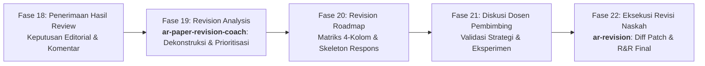

# Panduan Alur Kerja Pipeline `ar-paper-revision-coach` (Fase 19–21)

Dokumen ini merupakan panduan operasional mendalam untuk skill `ar-paper-revision-coach`, yang bertugas mendekonstruksi komentar reviewer mentah menjadi rencana aksi terstruktur sebelum naskah diubah.

---

## 1. Posisi dalam Siklus Riset Akademik (Kluster E)

Dalam siklus publikasi internasional 29 fase, peran coaching berada tepat setelah penerimaan hasil review dan sebelum naskah direvisi:

> [!IMPORTANT]
> **Batasan Peran**: `ar-paper-revision-coach` **TIDAK MENGUBAH TEKS NASKAH**. Tujuannya adalah menghasilkan lembar kerja dan strategi matang yang dibawa ke meja dosen pembimbing (Fase 21) sebelum peneliti menjalankan eksperimen tambahan atau mengetik revisi di Fase 22.

---

## 2. Enam Tahap Pemrosesan Komprehensif

### Tahap 1: Koleksi & Validasi Masukan (Input Ingestion)
Menerima materi ulasan dari berbagai format:
- **Format Email Editor**: Teks surat keputusan dari sistem editorial (*ScholarOne, Editorial Manager, Elsevier Editorial System*).
- **Salinan PDF**: Teks hasil *copy-paste* dari laporan bebestari jurnal.
- **Daftar Butir / Bebas**: Komentar bernomor, tanda strip, atau paragraf bebas.
- **Keluaran Simulasi Mock Review**: Berkas `07_editorial_decision.md` dan `08_revision_roadmap.md` dari skill `ar-paper-reviewer`.
- **Draf Naskah Bab (Opsional tapi Direkomendasikan)**: Untuk pemetaan akurat nomor baris, halaman, dan judul sub-bab aktual.

*Validasi Masukan*:
- Jika komentar kosong atau $< 50$ kata: Minta konfirmasi kelengkapan masukan kepada pengguna.
- Jika yang diinputkan adalah teks draf paper (bukan review): Berikan peringatan dini dan minta koreksi.

---

### Tahap 2: Penguraian Komentar & Pembagian Isu Jamak (Comment Parsing)
1. **Identifikasi Batas Reviewer**:
   Mendeteksi penanda batas: `Reviewer 1`, `R1`, `Reviewer #2`, `Editor-in-Chief`, `EIC`, `Devil's Advocate`, `DA`.
2. **Atribusi ID Unik**:
   Setiap butir komentar diberi identitas mesin yang stabil: `<ReviewerID>-<Nomor>` (misal: `R1-1`, `R1-2`, `DA-1`, `EIC-1`).
3. **Dekomposisi Komentar Jamak (*Compound Comments*)**:
   Jika reviewer menggabungkan dua permintaan berbeda dalam satu kalimat (contoh: *"Tolong tambahkan validasi pada dataset eksternal CQ500 dan jelaskan mengapa arsitektur ViT dipilih daripada ResNet"*):
   - **Wajib dipisahkan** menjadi dua komitmen terpisah agar dapat diverifikasi secara independen.
4. **Ekstraksi Teks Mentah, Ringkasan Parafrase, & Nada (*Tone*)**:
   - Teks asli disimpan utuh (*verbatim*).
   - Ringkasan dibuat dalam 1 kalimat jelas.
   - Nada dinilai: `Positive`, `Constructive`, `Critical`, atau `Ambiguous`.

---

### Tahap 3: Klasifikasi Mutu & Tingkat Keparahan (Classification)

Setiap butir komentar dikelompokkan ke dalam salah satu dari empat taksonomi:

| Kategori | Definisi Substantif | Konsekuensi Jika Diabaikan | Aksi Penulis |
| :--- | :--- | :--- | :--- |
| **`Major`** | Isu fundamental pada validitas metodologi, kebocoran data (*leakage*), ketepatan statistik, kebaruan klaim, atau penarikan kesimpulan. | Naskah akan ditolak (*rejection*). | Wajib diperbaiki (*Must fix*), sering kali menuntut eksperimen/analisis baru. |
| **`Minor`** | Isu kelengkapan penjelasan, perbandingan literatur tambahan, kejelasan grafik, atau pembahasan keterbatasan. | Menurunkan skor kelayakan naskah. | Harus diperbaiki (*Should fix*), biasanya cukup modifikasi teks/tabel. |
| **`Editorial`** | Tipo (*typo*), tata bahasa, kesalahan ejaan, format persamaan, gaya referensi, atau format caption. | Mengganggu keterbacaan profesional. | Perbaikan cepat (*Quick fix* / `prose_edit`). |
| **`Positive`** | Pujian atas orisinalitas, apresiasi metode, atau persetujuan temuan. | Tidak mempengaruhi status teknis. | Diakui dalam surat tanggapan tanpa tindakan naskah (*Acknowledgment only*). |

---

### Tahap 4: Ekstraksi Komitmen Pas (Commitment Extraction Pass)
Mengikuti standar **Kong et al. 2026 §7.4.3** dan Kontrak **Schema 11 (#268)**:
- Mendeteksi kata kerja operasional (*imperative phrases*): *"please add"*, *"include"*, *"run ablation"*, *"clarify"*, *"cite"*, *"discuss"*.
- Membentuk objek komitmen bersarang (*nested-object shape*) yang mengikat:
  1. `commitment_text`: Janji tindakan spesifik.
  2. `commitment_type`: Salah satu dari 6 kategori (`add_experiment`, `add_analysis`, `add_clarification`, `add_citation`, `restructure`, `other`).
  3. `required_evidence_type`: Salah satu dari 9 tipe bukti (7 pada naskah, 1 pada surat respons, 1 *escape-hatch*).

---

### Tahap 5: Pemetaan Bab Naskah (Section Mapping)

Memetakan target perbaikan ke berkas bab Markdown spesifik:
- `00_abstract.md`: Isu judul, abstrak, limitasi kata, kata kunci.
- `01_introduction.md`: Latar belakang, rumusan masalah, motivasi, klaim kontribusi, *claim boundary*.
- `02_related-works.md`: Teori pembanding, sitasi SOTA yang terlewat, matriks komparasi literatur.
- `03_methodology.md`: Partisi data (*patient-level split*), arsitektur model, formula matematika, prosedur pelatihan.
- `04_results.md`: Tabel metrik, grafik ROC/PR, uji signifikansi statistik (nilai p, CI 95%), visualisasi Grad-CAM.
- `05_discussion.md`: Interpretasi klinis/teoretis, komparasi temuan, limitasi studi (*limitations*), riset masa depan.
- `06_references.md`: Entri bibliografi baru, kelengkapan DOI.
- `general`: Isu alur logika keseluruhan atau struktur makro.

---

### Tahap 6: Prioritisasi 3-Tier (Schema 7)

Setiap isu dialokasikan prioritas eksekusi:

1. **`P1 (must_fix)`**:
   - Seluruh isu `Major`.
   - Seluruh komentar yang diangkat oleh Editor-in-Chief (EIC).
   - Temuan *Critical* dari Devil's Advocate (misal: *data leakage*, *p-hacking*).
2. **`P2 (should_fix)`**:
   - Isu `Minor` yang meningkatkan kekokohan bukti atau metodologi.
   - Komentar yang direkomendasikan kuat oleh penilai.
3. **`P3 (consider)`**:
   - Saran opsional yang tidak mempengaruhi validitas.
   - Perbaikan tipografi, gaya bahasa, dan kosmetik editorial.

*Aturan Promosi Prioritas*:
- Jika suatu isu diangkat secara independen oleh $\ge 2$ reviewer $\to$ **Dinaikkan 1 level** (P2 menjadi P1).
- Jika isu minor berada di bab yang disorot khusus oleh EIC $\to$ **Dinaikkan menjadi P2**.

---

## 3. Estimasi Beban Kerja Revisi (Effort Estimation)

| Tingkat Beban | Kriteria Objektif | Rentang Waktu Tipikal | Strategi Eksekusi |
| :--- | :--- | :--- | :--- |
| **`Light`** | 0–2 Major, $< 5$ Minor, mayoritas editorial. | 1 – 3 Hari | Perbaikan teks langsung, penambahan sitasi, klarifikasi narasi. |
| **`Moderate`** | 3–5 Major, 5–10 Minor. | 1 – 2 Minggu | Eksperimen ablasi tambahan pada data yang ada, pembuatan tabel baru, penulisan ulang sub-bab pembahasan. |
| **`Substantial`** | $> 5$ Major, atau membutuhkan pengambilan data baru / cohort eksternal. | 2 – 4 Minggu | Memerlukan pelatihan ulang model GPU, integrasi dataset rumah sakit mitra, revisi metodologi besar. |
| **`Fundamental`** | Cacat fatal validitas desain, penolakan hipotesis inti, atau restrukturisasi total studi. | $> 4$ Minggu | Pertimbangkan menarik naskah (*Withdrawal*) atau kirim ulang sebagai studi baru (*Revise & Resubmit*). |

---

## 4. Panduan Bimbingan Pra-Konsultasi Dosen (Fase 21)

Sebelum mengetik draf revisi di Fase 22, peneliti membawa berkas `08_revision_roadmap.md` kepada dosen pembimbing untuk menyepakati batasan:

### Skrip Talking Points Mahasiswa ke Dosen:
> *"Selamat pagi Prof/Dokter. Kami telah menerima hasil peer-review dari jurnal target dengan keputusan Major Revision. Kami telah membedah seluruh [N] komentar reviewer ke dalam matriks Revision Roadmap terstruktur:*
> 1. *Reviewer 1 meminta pengujian ketahanan model terhadap variasi scanner vendor lain. Kami merancang eksperimen tambahan pada 40 kasus eksternal dataset CQ500 tanpa mengubah arsitektur.*
> 2. *Reviewer 2 menanyakan theoretical framework pembanding. Kami telah menyiapkan draf pembahasan 2 paragraf di bab Discussion.*
> 3. *Untuk permintaan Reviewer 3 mengenai uji klinis prospektif, kami mengusulkan untuk mengklasifikasikannya sebagai Deliberate Limitation di bab Keterbatasan karena kendala waktu etik IRB.*
>
> *Berikut draf Response Letter Skeleton yang sudah kami siapkan. Mohon arahan dan persetujuan Prof sebelum kami jalankan eksperimen tambahan dan memperbarui naskah."*
