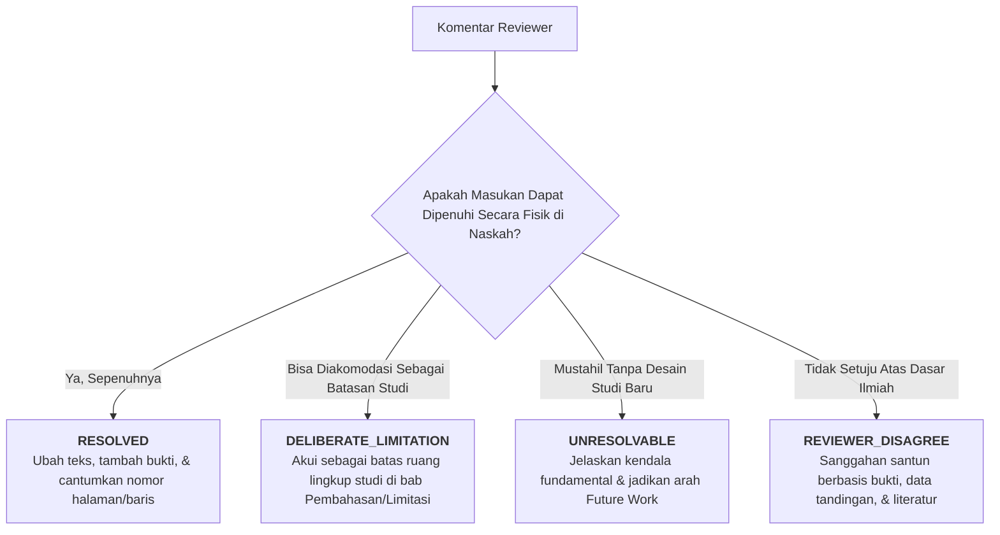

# Panduan Status Resolusi & Penanganan Isu Reviewer

Dokumen ini menjelaskan taksonomi empat status resolusi isu revisi (`RESOLVED`, `DELIBERATE_LIMITATION`, `UNRESOLVABLE`, `REVIEWER_DISAGREE`) serta standar bukti pendukung yang wajib disertakan pada dokumen *Revision Tracking Table*.

---

## 1. Empat Status Resolusi Kanonikal

Setiap butir komentar reviewer yang tercatat dalam matriks pelacakan wajib diselesaikan ke dalam salah satu dari empat status berikut:

---

## 2. Rincian Kriteria & Bukti Wajib per Status

### 1. `RESOLVED` (Masalah Terselesaikan Penuh)
Komentar reviewer diterima sepenuhnya dan tindakan korektif telah dieksekusi secara konkret pada naskah.

* **Bukti Wajib Disertakan**:
  - Lokasi persis perubahan pada naskah baru (Nomor Bab, Halaman, dan Paragraf/Tabel).
  - Ringkasan perubahan teks yang dilakukan.
* **Contoh Kasus**:
  > *"Menambahkan interval kepercayaan 95% untuk seluruh metrik sensitivitas dan spesifisitas pada Tabel 3, serta menyertakan uji signifikansi DeLong test (p = 0.0021) di Bagian 4.2 Paragraf 3."*

---

### 2. `DELIBERATE_LIMITATION` (Batasan Desain yang Disengaja)
Permintaan reviewer diakui sebagai batas ruang lingkup yang sah dari rancangan penelitian (*boundary condition*), bukan kelalaian atau kecacatan metodologis.

* **Kriteria Penggunaan**:
  - Permintaan berada di luar fokus utama studi (contoh: reviewer meminta evaluasi stroke hemoragik padahal paper fokus mendalam pada stroke iskemik dini).
  - Kendala metodologis yang memang disengaja (misal: desain potong lintang / *cross-sectional* karena data tindak lanjut jangka panjang belum tersedia).
* **Bukti Wajib Disertakan**:
  - Argumentasi saintifik mengapa batasan ini merupakan keputusan desain yang rasional.
  - Rujukan ke Bagian *Limitations* pada Bab Pembahasan (`05_discussion.md`) di mana batasan ini diakui secara transparan.
* **Contoh Kasus**:
  > *"Keterbatasan pengujian pada citra CT non-kontras tanpa angiografi (CTA) diakui sebagai ruang lingkup darurat IGD pada Bagian 5.3 Paragraf 2, mengingat fasilitas CTA jarang tersedia dalam 3 jam pertama di rumah sakit tipe C."*

---

### 3. `UNRESOLVABLE` (Tidak Dapat Diselesaikan Tanpa Studi Baru)
Permintaan reviewer menuntut sumber daya, data klinis, atau waktu yang secara fundamental mustahil dipenuhi dalam koridor putaran revisi ini.

* **Kriteria Penggunaan**:
  - Reviewer menuntut uji klinis prospektif multisenter yang membutuhkan izin etik IRB baru dan waktu observasi bertahun-tahun.
  - Reviewer menuntut data retrospektif dari populasi geografis lain yang tidak memiliki akses data terbuka.
* **Bukti Wajib Disertakan**:
  - Penjelasan kendala objektif (hukum etik, ketiadaan data publik, atau batasan waktu editorial jurnal).
  - Pernyataan tertulis yang menempatkan saran reviewer sebagai agenda utama *Future Research* di Bab Kesimpulan.
* **Contoh Kasus**:
  > *"Validasi prospektif pada 500 pasien IGD secara *real-time* tidak dapat dilaksanakan dalam batas waktu revisi 60 hari jurnal dan memerlukan persetujuan komite etik baru. Kebutuhan uji prospektif ini telah kami formulasikan sebagai arah riset masa depan pada Bagian 5.4."*

---

### 4. `REVIEWER_DISAGREE` (Ketidaksepakatan Ilmiah yang Santun)
Penulis secara sadar dan beralasan menolak saran atau kesimpulan reviewer karena dinilai keliru secara teoretis, empiris, atau matematis.

* **Kriteria Penggunaan**:
  - Reviewer mengusulkan metode yang secara literatur telah terbukti menimbulkan bias (contoh: meminta penggunaan SMOTE pada data tabular klinis yang merusak kalibrasi risiko).
  - Reviewer salah menafsirkan formula atau definisi istilah yang digunakan penulis.
* **Bukti Wajib Disertakan**:
  - Argumentasi berbasis data tandingan (*empirical evidence*).
  - Sitasi literatur bereputasi tinggi yang memvalidasi keputusan metodologis penulis.
  - Register bahasa diplomatik, objektif, dan menghormati keahlian reviewer.
* **Contoh Kasus**:
  > *"Kami sangat menghargai saran penilai untuk menerapkan oversampling SMOTE pada dataset yang tidak seimbang. Namun, dengan segala hormat, penelitian terbaru van den Goorbergh et al. (2022) pada IEEE TBME membuktikan bahwa interpolasi sintetis SMOTE pada citra medis berisiko tinggi menghasilkan artefak anatomi palsu. Kami mempertahankan pendekatan cost-sensitive weighted loss yang terbukti lebih aman klinis, dengan penjelasan komparatif mendalam pada respon poin R1-W2."*

---

## 3. Matriks Rekonsiliasi Status Revisi

| Status | Mengubah Naskah? | Merujuk Halaman Naskah? | Butuh Sitasi Pembelaan? |
| :--- | :---: | :---: | :---: |
| **`RESOLVED`** | ✅ Ya | ✅ Wajib | Opsional |
| **`DELIBERATE_LIMITATION`** | ✅ Ya (Bab Limitasi) | ✅ Wajib | Disarankan |
| **`UNRESOLVABLE`** | ✅ Ya (Bab Future Work) | ✅ Wajib | Opsional |
| **`REVIEWER_DISAGREE`** | ❌ Tidak (Teks naskah dipertahankan) | ❌ Tidak | ✅ Wajib Otoritatif |
