# Panduan Siklus Hidup & Urutan Penggunaan Skill Akademik `ar-paper`

Dokumen ini merupakan panduan orkestrasi resmi (*standard operating procedure*) mengenai urutan kronologis eksekusi **11 skill akademik modular (`ar-paper-*`)** dalam repositori ini. Alur ini dirancang untuk memandu periset dan asisten AI dari perancangan kerangka awal hingga pembentukan paket publikasi LaTeX siap submit ke portal jurnal internasional bereputasi (IEEE, ACM, Springer Nature, Elsevier).

---

## 1. Diagram Alur Siklus Hidup Penelitian (*End-to-End Workflow*)

```mermaid
flowchart TD
    subgraph K1 ["Kluster 1: Perancangan Kerangka"]
        S1["1. ar-paper-outline<br/>(Cetak Biru Per Paragraf)"]
    end

    subgraph K2 ["Kluster 2: Penulisan Draf Bab"]
        S2["2. ar-paper-draft<br/>(Draf Bab Modular Satu per Satu)"]
    end

    subgraph K3 ["Kluster 3: Kurasi & Kompilasi Sitasi"]
        S3["3. ar-paper-sentence-citation<br/>(Ekstraksi Klaim & Kurasi .bib)"]
        S4["4. ar-paper-reference-compiler<br/>(Kompilasi 06_references.md)"]
        S5["5. ar-paper-citation-numbering<br/>(Injeksi Sitasi Braket Teks [[N]])"]
    end

    subgraph K4 ["Kluster 4: Bagian Depan Naskah"]
        S6["6. ar-paper-abstract<br/>(Abstrak 5 Komponen & Kata Kunci)"]
    end

    subgraph K5 ["Kluster 5: Simulasi Peer Review"]
        S7["7. ar-paper-reviewer<br/>(Mock Review 5 Panelis Independen)"]
    end

    subgraph K6 ["Kluster 6: Dekonstruksi, Revisi & Audit"]
        S8["8. ar-paper-revision-coach<br/>(Parsing Review & Matriks Komitmen)"]
        S9["9. ar-paper-revision<br/>(Eksekusi Patch Presisi Blok #390)"]
        S10["10. ar-paper-rebuttal-audit<br/>(Audit Penjaminan Mutu Rebuttal QA)"]
    end

    subgraph K7 ["Kluster 7: Penyiapan Berkas Submit"]
        S11["11. ar-paper-latex-converter<br/>(Konversi ke Proyek LaTeX Modular)"]
    end

    S1 -->|paper_outline.md| S2
    S2 -->|paper/*.md tanpa sitasi| S3
    S3 -->|references.txt & references/*.bib| S4
    S4 -->|06_references.md ber-anchor| S5
    S5 -->|paper/*.md ber-sitasi lengkap| S6
    S6 -->|00_abstract.md & acronyms.txt| S7
    S7 -->|07_editorial_decision.md| S8
    S8 -->|08_revision_roadmap.md & skeleton| S9
    S9 -->|Naskah terevisi & draft rebuttal| S10
    S10 -->|Rebuttal PASSED_READINESS| S11
    S11 -->|paper_latex/ siap submit| TargetSubmit["Portal Jurnal / Konferensi"]
```

---

## 2. Tabel Ringkasan Urutan Eksekusi

| Urutan | Nama Skill | Masukan Utama (*Input*) | Keluaran Utama (*Output*) | Peran Kunci |
|:---:|:---|:---|:---|:---|
| **1** | [**`ar-paper-outline`**](file:///D:/Code/docs-and-skills/skills/ar-paper-outline/SKILL.md) | Ide riset, RQ, temuan eksperimen | `paper_outline.md` | Kerangka per paragraf, target kata, boundary klaim |
| **2** | [**`ar-paper-draft`**](file:///D:/Code/docs-and-skills/skills/ar-paper-draft/SKILL.md) | `paper_outline.md` | `01_introduction.md` s/d `05_conclusion.md` | Penulisan draf modular 1 bab per waktu (CARS/CER) |
| **3** | [**`ar-paper-sentence-citation`**](file:///D:/Code/docs-and-skills/skills/ar-paper-sentence-citation/SKILL.md) | Draf bab naskah `paper/*.md` | `paper/references.txt` & `paper/references/*.bib` | Pencarian literatur per kalimat, verifikasi DOI/S2 |
| **4** | [**`ar-paper-reference-compiler`**](file:///D:/Code/docs-and-skills/skills/ar-paper-reference-compiler/SKILL.md) | `references.txt` & `references/*.bib` | `paper/06_references.md` | Kompilasi daftar pustaka akhir ber-anchor interaktif |
| **5** | [**`ar-paper-citation-numbering`**](file:///D:/Code/docs-and-skills/skills/ar-paper-citation-numbering/SKILL.md) | Draf bab, `references.txt`, `06_references.md` | Draf bab ber-sitasi `[[N]](06_references.md#refN)` | Injeksi nomor sitasi braket teks presisi tanda baca |
| **6** | [**`ar-paper-abstract`**](file:///D:/Code/docs-and-skills/skills/ar-paper-abstract/SKILL.md) | Draf bab lengkap `01` s/d `05` | `00_abstract.md` & `acronyms.txt` | Abstrak 5 komponen, registrasi akronim, kata kunci |
| **7** | [**`ar-paper-reviewer`**](file:///D:/Code/docs-and-skills/skills/ar-paper-reviewer/SKILL.md) | Naskah lengkap `paper/*.md` | `07_editorial_decision.md` | Simulasi mock peer review 5 panelis (Schema 13) |
| **8** | [**`ar-paper-revision-coach`**](file:///D:/Code/docs-and-skills/skills/ar-paper-revision-coach/SKILL.md) | Komentar review mentah / Keputusan editor | `08_revision_roadmap.md` & rangka rebuttal | Parsing ulasan, commitment ledger, talking points |
| **9** | [**`ar-paper-revision`**](file:///D:/Code/docs-and-skills/skills/ar-paper-revision/SKILL.md) | Draf bab, roadmap, `revision_patch.json` | Naskah terevisi presisi blok & `<draft>.apply-report.json` | Eksekusi patch diff fail-closed (Spec #390) |
| **10** | [**`ar-paper-rebuttal-audit`**](file:///D:/Code/docs-and-skills/skills/ar-paper-rebuttal-audit/SKILL.md) | Komentar review & draf surat tanggapan | `11_rebuttal_audit_report.md` | Audit QA zero-orphan, diplomasi nada AVEC, bukti lokator |
| **11** | [**`ar-paper-latex-converter`**](file:///D:/Code/docs-and-skills/skills/ar-paper-latex-converter/SKILL.md) | Folder naskah final `paper/` & aset gambar | Paket LaTeX `paper_latex/` (`access.tex` / `main.tex`) | Konversi ke LaTeX modular siap submit (IEEE/ACM/Springer) |

---

## 3. Penjelasan Rinci Alur Kerja per Langkah

### Langkah 1: Perancangan Kerangka Naskah (`ar-paper-outline`)
- **Fungsi**: Merancang struktur artikel ilmiah sampai level cetak biru paragraf (*paragraph-by-paragraph blueprints*).
- **Aktivitas Utama**:
  - Menentukan model retorika (IMRaD, Tinjauan Tematik, atau Teoretis).
  - Menyusun tujuan spesifik tiap paragraf, poin narasi kunci, alokasi target jumlah kata, rencana peletakan tabel/gambar, dan kalimat transisi.
  - Menetapkan batas klaim ilmiah (*allowed claims vs negative constraints*).
- **Kriteria Lolos (Gate Check)**: Berkas `paper_outline.md` selesai disusun dan disetujui penulis sebelum menulis teks narasi.

---

### Langkah 2: Penulisan Draf Bab Modular (`ar-paper-draft`)
- **Fungsi**: Menulis teks naskah akademik bab demi bab secara independen ke dalam berkas Markdown terpisah.
- **Aktivitas Utama**:
  - Mengeksekusi penulisan 1 berkas per waktu:
    * `01_introduction.md` (mengikuti model CARS: *Establish Territory $\to$ Establish Niche $\to$ Occupy Niche*).
    * `02_related-works.md` (sintesis komparatif tematik).
    * `03_materials-and-methods_*.md` (rincian dataset, arsitektur, parameter).
    * `04_results-and-discussion_*.md` (pola penalaran CER: *Claim $\to$ Evidence $\to$ Reasoning*).
    * `05_conclusion.md` (ringkasan kontribusi, limitasi eksplisit, riset masa depan).
  - Menerapkan standar anti-slop akademik (bebas kata klise seperti *"testament"*, *"tapestry"*, *"game-changer"*).
- **Kriteria Lolos (Gate Check)**: Draf seluruh bab selesai ditulis narasi logisnya (draf masih bersih tanpa nomor sitasi braket).

---

### Langkah 3: Penelusuran & Pemetaan Sitasi Kalimat (`ar-paper-sentence-citation`)
- **Fungsi**: Memverifikasi setiap klaim faktual/kuantitatif dalam teks dan mencari literatur ilmiah bereputasi pendukungnya.
- **Aktivitas Utama**:
  - Memindai kalimat naskah untuk mendeteksi asersi yang membutuhkan sitasi (angka, klaim SOTA, metodologi terdahulu).
  - Merumuskan kueri akademis dan memvalidasi literatur melalui API (Crossref, Semantic Scholar, OpenAlex, arXiv).
  - Mengunduh rekaman bibliografi terverifikasi ke folder `paper/references/` dengan penamaan terstandar `[Tahun]_[Judul].[ext]`.
  - Menyusun berkas pemetaan sintaksis `paper/references.txt`.
- **Kriteria Lolos (Gate Check)**: Seluruh klaim krusial memiliki pasangan rujukan terverifikasi di `paper/references.txt` dan berkas `.bib` tersimpan lokal.

---

### Langkah 4: Kompilasi Naskah Daftar Pustaka (`ar-paper-reference-compiler`)
- **Fungsi**: Menyusun naskah daftar pustaka akhir yang diformat secara presisi sesuai gaya jurnal target.
- **Aktivitas Utama**:
  - Mengompilasi entri dari `paper/references.txt` dan rekaman bibliografi `.bib`.
  - Menerapkan format sitasi standar: **IEEE** numerik ber-anchor, **APA 7th**, **Harvard**, **ACM**, atau **Vancouver**.
  - Menyediakan jangkar tautan interaktif pada setiap entri: ` [N] ...`.
  - Menjalankan audit segitiga integritas referensi (zero-orphan, verifikasi DOI).
- **Kriteria Lolos (Gate Check)**: Terbitnya berkas `paper/06_references.md` yang tervalidasi dan siap ditautkan.

---

### Langkah 5: Injeksi Penomoran Sitasi Teks (`ar-paper-citation-numbering`)
- **Fungsi**: Menghubungkan teks naskah bab dengan daftar pustaka melalui injeksi nomor sitasi braket interaktif.
- **Aktivitas Utama**:
  - Membaca pemetaan kalimat dari `paper/references.txt`.
  - Menyuntikkan nomor sitasi berformat `[[N]](06_references.md#refN)` ke dalam berkas bab (`paper/*.md`).
  - Menempatkan sitasi secara presisi **sebelum tanda baca titik atau koma** (gaya IEEE).
  - Mendukung multi-sitasi terpisah (`[[1]](...), [[2]](...)`) dan menjamin idempotensi (tidak terjadi duplikasi injeksi bila dijalankan ulang).
- **Kriteria Lolos (Gate Check)**: Laporan audit integritas membuktikan 0 sitasi yatim (*zero-orphan in-text citations*).

---

### Langkah 6: Finalisasi Abstrak & Metadata Depan (`ar-paper-abstract`)
- **Fungsi**: Menyusun abstrak akademik terpadu dan mengelola metadata kepengarangan.
- **Aktivitas Utama**:
  - Mengimplementasikan model retorika 5 komponen: *Context/Problem $\to$ Purpose $\to$ Methodology $\to$ Quantitative Findings $\to$ Implications*.
  - Mengisolasi penulisan kepanjangan akronim pada pemunculan pertama dan mencatatnya ke dalam registri `paper/acronyms.txt`.
  - Mengurasi 5–7 kata kunci representatif (*Keywords / Index Terms*).
  - Menyiapkan metadata kepengarangan, afiliasi, corresponding author, dan nomor ORCID pada `00_title.md` / `authors.txt`.
- **Kriteria Lolos (Gate Check)**: Berkas `paper/00_abstract.md` memenuhi batas kata jurnal target (150–250 kata) dengan temuan numerik konkret.

---

### Langkah 7: Simulasi Mock Peer Review (`ar-paper-reviewer`)
- **Fungsi**: Melakukan audit independen ketat sebelum naskah diajukan ke pembimbing atau portal jurnal.
- **Aktivitas Utama**:
  - Mensimulasikan panel 5 penilai independen berdasarkan Kontrak Sprint Schema 13:
    1. *Editor-in-Chief (EIC)*: Kelayakan ruang lingkup dan dampak.
    2. *Methodology Reviewer*: Integritas data, kebocoran data (*data leakage*), validasi silang, dan *p-hacking*.
    3. *Domain Expert*: Kebaruan (*novelty*) terhadap SOTA dan ketepatan terminologi domain.
    4. *Cross-Perspective Analyst*: Keseimbangan sudut pandang dan perbandingan komparatif.
    5. *Devil's Advocate*: Penantang adversarial tanpa kompromi (mencari kelemahan fatal tersembunyi).
  - Menghasilkan Surat Keputusan Editorial formal (`07_editorial_decision.md`) dengan status *Accept, Minor Revision, Major Revision,* atau *Reject*.
- **Kriteria Lolos (Gate Check)**: Penulis memegang daftar rekomendasi perbaikan terstruktur sebelum bimbingan dosen atau pengiriman naskah.

---

### Langkah 8: Dekonstruksi Ulasan Reviewer (`ar-paper-revision-coach`)
- **Fungsi**: Mengubah komentar ulasan mentah menjadi strategi rencana perbaikan yang terorganisasi.
- **Aktivitas Utama**:
  - Mengurai komentar bebas (email editor, PDF review, atau hasil mock review).
  - Mengklasifikasikan butir kritik ke dalam 4 taksonomi (Major, Minor, Editorial, Positive) dan prioritas perbaikan (P1: *must_fix*, P2: *should_fix*, P3: *consider*).
  - Menyusun matriks komitmen perbaikan (*commitment ledger* Kong et al. 2026) dalam `08_revision_roadmap.md`.
  - Menyiapkan rangka surat sanggahan formal (*Response Letter Skeleton*) berpola *Restatement $\to$ Authors' Response $\to$ Manuscript Changes*.
- **Kriteria Lolos (Gate Check)**: Seluruh kritik terpetakan ke nomor bab yang bersangkutan tanpa ada poin reviewer yang terabaikan.

---

### Langkah 9: Eksekusi Revisi Naskah Presisi Blok (`ar-paper-revision`)
- **Fungsi**: Menerapkan perbaikan naskah secara deterministik tanpa menulis ulang seluruh dokumen (Mode Patch/Diff Presisi Blok).
- **Aktivitas Utama**:
  - **Fase 1 (Anchorize)**: Menempelkan stempel `<!--block:BNNNN-->` pada draf naskah via `ars_anchorize_draft.py` dan menerbitkan manifest blok.
  - **Fase 2 (Patch Creation)**: Menyusun instruksi modifikasi terstruktur `revision_patch.json` (`replace_block`, `insert_after`, `delete_block`).
  - **Fase 3 (Deterministic Apply)**: Menjalankan `ars_apply_revision_patch.py` dengan validasi dua fase *fail-closed* (satu hash tidak cocok membatalkan seluruh apply).
  - **Fase 4 (Downstream Sync)**: Menyalin ID blok hasil revisi (`B0042`) ke dalam surat tanggapan reviewer.
- **Kriteria Lolos (Gate Check)**: Teks yang tidak disentuh revisi terbukti identik secara biner (*byte-identical*); laporan `<draft>.apply-report.json` diterbitkan.

---

### Langkah 10: Audit Mutu Surat Tanggapan Reviewer (`ar-paper-rebuttal-audit`)
- **Fungsi**: Memeriksa kualitas draf surat tanggapan reviewer (*rebuttal letter*) sebelum diserahkan ke pembimbing atau portal jurnal.
- **Aktivitas Utama**:
  - Mengaktifkan gerbang masukan ganda (*dual-document gate*): membutuhkan berkas komentar reviewer DAN draf tanggapan penulis.
  - Mengevaluasi 4 dimensi mutu:
    1. *Zero-Orphan Coverage*: 100% komentar reviewer terjawab.
    2. *Tone & Academic Diplomacy*: Bersih dari nada defensif/agresif (*combative*), menggunakan pola diplomasi AVEC (*Acknowledge $\to$ Validate $\to$ Evidence $\to$ Clarify*).
    3. *Evidence Grounding & Locators*: Klaim perbaikan menyertakan lokasi presisi (Section, Halaman, Tabel, atau Block ID `B0042`).
    4. *Disagreement Justification*: Penolakan saran disertai bukti ilmiah atau batasan cakupan yang sah.
- **Kriteria Lolos (Gate Check)**: Meraih status **`PASSED_READINESS`** pada `11_rebuttal_audit_report.md`.

---

### Langkah 11: Konversi Proyek Publikasi LaTeX Siap Submit (`ar-paper-latex-converter`)
- **Fungsi**: Mengonversi naskah Markdown yang telah tuntas direvisi ke dalam format LaTeX modular standar publikasi.
- **Aktivitas Utama**:
  - Mengonversi berkas bab Markdown secara 1:1 ke dalam folder `paper_latex/sections/*.tex`.
  - Menyusun dokumen induk orkestrator (`access.tex` untuk IEEE Access atau `main.tex` untuk template lain).
  - Membersihkan stempel blok `<!--block:BNNNN-->`, komentar HTML, dan tag jangkar.
  - Mengonversi tabel Markdown ke format tipografi bersih `booktabs` (`\toprule`, `\midrule`, `\bottomrule`) tanpa garis vertikal.
  - Mengonversi gambar dengan kepatuhan mutlak aturan urutan **`\caption{...}` diletakkan SEBELUM `\label{...}`**.
  - Menyatukan basis data sitasi menjadi `references.bib` dan menyalin aset gambar ke `images/`.
  - Menjalankan linter verifikasi disiplin publikasi `verify_latex_integrity.py`.
- **Kriteria Lolos (Gate Check)**: Linter melaporkan status **`PASSED`** (0 error); naskah siap dikompilasi via `pdflatex` atau diekspor ke DOCX/PDF.

---

## 4. Matriks Ketergantungan Berkas (*Artifact Lineage Matrix*)

| Langkah | Skill yang Digunakan | Berkas yang Dibaca (*Input*) | Berkas yang Dihasilkan (*Output*) |
|:---|:---|:---|:---|
| 1 | `ar-paper-outline` | Ide riset, catatan data | `paper_outline.md` |
| 2 | `ar-paper-draft` | `paper_outline.md` | `paper/01_*.md` s/d `paper/05_*.md` |
| 3 | `ar-paper-sentence-citation` | `paper/*.md` | `paper/references.txt`, `paper/references/*.bib` |
| 4 | `ar-paper-reference-compiler` | `paper/references.txt`, `paper/references/*.bib` | `paper/06_references.md` |
| 5 | `ar-paper-citation-numbering` | `paper/*.md`, `references.txt`, `06_references.md` | Injeksi `[[N]](...)` ke dalam `paper/*.md` |
| 6 | `ar-paper-abstract` | `paper/*.md` (bab 01–05 lengkap) | `paper/00_abstract.md`, `paper/acronyms.txt` |
| 7 | `ar-paper-reviewer` | Seluruh `paper/*.md` | `paper/07_editorial_decision.md` |
| 8 | `ar-paper-revision-coach` | `07_editorial_decision.md` / email review | `paper/08_revision_roadmap.md`, `response_skeleton.md` |
| 9 | `ar-paper-revision` | `paper/*.md`, `revision_patch.json` | `paper/*.md` (revised), `apply-report.json` |
| 10 | `ar-paper-rebuttal-audit` | Reviewer comments & draf response letter | `paper/11_rebuttal_audit_report.md` |
| 11 | `ar-paper-latex-converter` | `paper/*.md`, `paper/images/`, `references/` | `paper_latex/access.tex`, `paper_latex/sections/*.tex` |

---

## 5. Aturan Integritas & Larangan (*Iron Rules & Anti-Patterns*)

> [!CAUTION]
> **Hal-Hal yang DILARANG Dilakukan dalam Alur Penelitian**:
> 
> 1. **DILARANG menyuntikkan nomor sitasi sebelum `06_references.md` selesai dikompilasi**: Penomoran braket `[[N]]` pada Langkah 5 bergantung mutlak pada urutan kemunculan definitif di Langkah 4.
> 2. **DILARANG menulis abstrak di awal riset**: Abstrak (Langkah 6) wajib memuat ringkasan temuan kuantitatif riil dari bab hasil eksperimen (Langkah 2). Menulis abstrak di awal memicu halusinasi metrik dan inkonsistensi data.
> 3. **DILARANG mengubah naskah bab secara manual saat fase revisi jika menggunakan patch-mode**: Penambahan karakter manual merusak hash manifest blok naskah dan menyebabkan penolakan *fail-closed* pada mesin patch `ar-paper-revision`.
> 4. **DILARANG menempatkan `\label{...}` sebelum `\caption{...}` pada LaTeX**: Kesalahan urutan ini menyebabkan kompilator menautkan nomor bab alih-alih nomor gambar/tabel.
> 5. **DILARANG meletakkan nomor sitasi setelah titik atau koma**: Sesuai kaidah IEEE, sitasi wajib berada sebelum tanda baca kalimat (`... didemonstrasikan \cite{ref1}.`).
> 6. **DILARANG menggunakan karakter em dash (`—`) pada berkas LaTeX**: Selalu gunakan tanda hubung standar (`-`) atau kurung untuk mencegah kegagalan rendering font kompilator.
