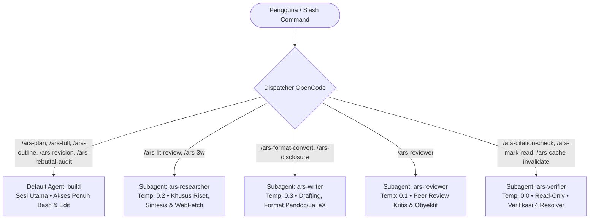

# Panduan Lengkap Skills & Slash Commands: OpenCode Academic Research Skills (ARS)
## Serta Best Practice Workflow Publikasi Paper Klasifikasi Stroke Otak (MRI / CT-Scan)
### Terintegrasi Penuh dengan Siklus 29 Fase Riset Akademik Internasional & Panduan Contoh Prompt Lengkap

---

## DAFTAR ISI
1. [Arsitektur & Taksonomi 4 Skill Inti](#1-arsitektur--taksonomi-4-skill-inti)
   - 1.1 `deep-research` (v2.11.0)
   - 1.2 `academic-paper` (v3.2.0)
   - 1.3 `academic-paper-reviewer` (v1.10.0)
   - 1.4 `academic-pipeline` (v3.19.0)
2. [Eksplorasi Mendalam 16 Perintah Slash (`/ars-*`)](#2-eksplorasi-mendalam-16-perintah-slash-ars-)
   - Matriks Komparasi 16 Perintah
   - Bedah Detail Setiap Perintah (Sintaks, Subagent, Mekanisme, Output)
3. [Subagent Routing & Isolasi Eksekusi OpenCode](#3-subagent-routing--isolasi-eksekusi-opencode)
4. [Analisis Fundamental: Apakah Diskusi dengan Dosen Bisa Digantikan oleh Command ARS?](#4-analisis-fundamental-apakah-diskusi-dengan-dosen-bisa-digantikan-oleh-command-ars)
   - 4.1 Mengapa Diskusi dengan Dosen Tidak Boleh & Tidak Bisa Digantikan Secara Total
   - 4.2 Peran Nyata Command ARS: "Pre-Advising Sparring Partner"
   - 4.3 Matriks Kolaborasi: Mahasiswa vs Dosen Pembimbing vs Command ARS
5. [Best Practice Workflow & Contoh Prompt di Setiap Fase (Fase 1 – 29)](#5-best-practice-workflow--contoh-prompt-di-setiap-fase-fase-1--29)
   - **Kluster A: Konseptualisasi & Validasi Arah (Fase 1 – 5)**
   - **Kluster B: Desain Metodologi & Eksperimen Komputasi (Fase 6 – 11)**
   - **Kluster C: Penulisan Naskah & Simulasi Review Pra-Dosen (Fase 12 – 15)**
   - **Kluster D: Pengajuan Resmi ke Jurnal & Peer Review Riil (Fase 16 – 18)**
   - **Kluster E: Dekonstruksi Masukan & Konsultasi Revisi Dosen (Fase 19 – 21)**
   - **Kluster F: Eksekusi Revisi, Audit Rebuttal & Resubmission (Fase 22 – 26)**
   - **Kluster G: Penerimaan, Proofreading & Publikasi (Fase 27 – 29)**
6. [Tabel Ringkasan Pemetaan 29 Fase Riset, Peran Aktor & Command ARS](#6-tabel-ringkasan-pemetaan-29-fase-riset-peran-aktor--command-ars)

---

## 1. Arsitektur & Taksonomi 4 Skill Inti

Repositori [`opencode-academic-research`](file:///D:/Research/opencode-academic-research) mengelompokkan kapabilitas penelitian akademik ke dalam 4 modul skill terpisah di bawah direktori [`skills/`](file:///D:/Research/opencode-academic-research/skills). Seluruh skill mengimplementasikan standar YAML frontmatter OpenCode untuk penemuan otomatis (*auto-discovery*).

### 1.1 `deep-research` (v2.11.0)
- **Path Definisi:** [`skills/deep-research/SKILL.md`](file:///D:/Research/opencode-academic-research/skills/deep-research/SKILL.md)
- **Tingkat Akses Data (*Data Access Level*):** `raw` (Berinteraksi langsung dengan input mentah, web fetching, kueri API luar, dan dokumen unverified).
- **Jumlah Agen:** 14 agen khusus (misal: [`bibliography_agent.md`](file:///D:/Research/opencode-academic-research/skills/deep-research/agents/bibliography_agent.md), [`source_verification_agent.md`](file:///D:/Research/opencode-academic-research/skills/deep-research/agents/source_verification_agent.md), [`synthesis_agent.md`](file:///D:/Research/opencode-academic-research/skills/deep-research/agents/synthesis_agent.md), [`devils_advocate_agent.md`](file:///D:/Research/opencode-academic-research/skills/deep-research/agents/devils_advocate_agent.md)).
- **8 Mode Operasi:**
  1. `full`: Menghasilkan laporan riset komprehensif APA 7.0 (3.000–8.000 kata) lengkap dengan hierarki bukti klinis/ilmiah.
  2. `quick`: Risalah eksekutif ringkas (500–1.500 kata) untuk pengecekan hipotesis awal.
  3. `review`: Laporan evaluasi kritis terhadap suatu paper atau artikel ilmiah yang disediakan pengguna.
  4. `lit-review`: Bibliografi beranotasi sistematis beserta sintesis komparatif tematik.
  5. `three-way-scan`: Pemindaian cepat komparasi WHY / HOW / WHAT antar-paper untuk memetakan ceruk (*gap*).
  6. `fact-check`: Laporan verifikasi berbasis klaim demi klaim dengan atribusi sumber terverifikasi.
  7. `socratic`: Dialog reflektif berorientasi orisinalitas untuk memandu peneliti mempertajam pertanyaan riset.
  8. `systematic-review`: Tinjauan pustaka sistematis berstandar PRISMA 2020 (5.000–15.000 kata) dengan penilaian *risk of bias*.

### 1.2 `academic-paper` (v3.2.0)
- **Path Definisi:** [`skills/academic-paper/SKILL.md`](file:///D:/Research/opencode-academic-research/skills/academic-paper/SKILL.md)
- **Tingkat Akses Data (*Data Access Level*):** `redacted` (Hanya beroperasi pada informasi yang sudah disaring; dilarang menambahkan klaim baru tanpa atribusi bukti).
- **Jumlah Agen:** 12 agen khusus (misal: [`draft_writer_agent.md`](file:///D:/Research/opencode-academic-research/skills/academic-paper/agents/draft_writer_agent.md), [`structure_architect_agent.md`](file:///D:/Research/opencode-academic-research/skills/academic-paper/agents/structure_architect_agent.md), [`formatter_agent.md`](file:///D:/Research/opencode-academic-research/skills/academic-paper/agents/formatter_agent.md), [`citation_compliance_agent.md`](file:///D:/Research/opencode-academic-research/skills/academic-paper/agents/citation_compliance_agent.md)).
- **11 Mode Operasi:**
  1. `full`: Menulis draf lengkap paper (format IMRaD: Introduction, Methods, Results, and Discussion).
  2. `plan`: Perencanaan bab demi bab dialogis Socratic dengan pembuatan peta argumen.
  3. `outline-only`: Garis besar rinci, alokasi jumlah kata per sub-bab, dan pemetaan bukti (*evidence map*).
  4. `revision`: Menghasilkan draf revisi dan surat tanggapan *Point-by-Point Response to Reviewers*.
  5. `revision-coach`: Menganalisis kritik reviewer dan menyusun *Revision Roadmap* strategis.
  6. `abstract-only`: Abstrak terstruktur dwibahasa presisi tinggi beserta kata kunci.
  7. `lit-review`: Tinjauan pustaka yang disesuaikan secara langsung ke dalam format bab naskah.
  8. `format-convert`: Konversi dokumen ke LaTeX, DOCX (via Pandoc), atau PDF (via Tectonic).
  9. `citation-check`: Pemindaian ketidakcocokan sitasi dalam teks terhadap daftar pustaka.
  10. `disclosure`: Pembuatan pernyataan transparansi AI sesuai kebijakan spesifik jurnal.
  11. `rebuttal-audit`: Audit penjaminan mutu terhadap draf sanggahan/rebuttal peneliti.

### 1.3 `academic-paper-reviewer` (v1.10.0)
- **Path Definisi:** [`skills/academic-paper-reviewer/SKILL.md`](file:///D:/Research/opencode-academic-research/skills/academic-paper-reviewer/SKILL.md)
- **Tingkat Akses Data (*Data Access Level*):** `verified_only` (Data tertutup dari manipulasi luar; bertindak sebagai evaluator independen).
- **Jumlah Agen:** 7 agen khusus (misal: [`field_analyst_agent.md`](file:///D:/Research/opencode-academic-research/skills/academic-paper-reviewer/agents/field_analyst_agent.md), [`methodology_reviewer_agent.md`](file:///D:/Research/opencode-academic-research/skills/academic-paper-reviewer/agents/methodology_reviewer_agent.md), [`editorial_synthesizer_agent.md`](file:///D:/Research/opencode-academic-research/skills/academic-paper-reviewer/agents/editorial_synthesizer_agent.md), [`devils_advocate_reviewer_agent.md`](file:///D:/Research/opencode-academic-research/skills/academic-paper-reviewer/agents/devils_advocate_reviewer_agent.md)).
- **6 Mode Operasi:**
  1. `full`: Simulasi panel peer review 5 penilai independen (EIC, Metodologi, Domain, Perspektif Silang, dan Devil's Advocate) berlandaskan **Kontrak Sprint Schema 13**.
  2. `re-review`: Verifikasi ketertelusuran draf revisi terhadap komentar putaran sebelumnya (Matriks Schema 11).
  3. `quick`: Penilaian cepat EIC untuk menyaring kelemahan fatal (*fatal flaws*).
  4. `methodology-focus`: Penelaahan mendalam terhadap metodologi, desain eksperimen, dan validitas statistik.
  5. `guided`: Bimbingan Socratic interaktif bagi peneliti untuk memahami titik lemah paper.
  6. `calibration`: Pengukuran akurasi reviewer terhadap dataset emas (*gold standard*) mengukur FNR/FPR.

### 1.4 `academic-pipeline` (v3.19.0)
- **Path Definisi:** [`skills/academic-pipeline/SKILL.md`](file:///D:/Research/opencode-academic-research/skills/academic-pipeline/SKILL.md)
- **Tingkat Akses Data (*Data Access Level*):** `verified_only`
- **Jumlah Agen:** 5 agen koordinasi (misal: [`pipeline_orchestrator_agent.md`](file:///D:/Research/opencode-academic-research/skills/academic-pipeline/agents/pipeline_orchestrator_agent.md), [`integrity_verification_agent.md`](file:///D:/Research/opencode-academic-research/skills/academic-pipeline/agents/integrity_verification_agent.md), [`state_tracker_agent.md`](file:///D:/Research/opencode-academic-research/skills/academic-pipeline/agents/state_tracker_agent.md), [`claim_ref_alignment_audit_agent.md`](file:///D:/Research/opencode-academic-research/skills/academic-pipeline/agents/claim_ref_alignment_audit_agent.md)).
- **Fungsi Utama:** Mengorkestrasikan seluruh pipeline 10 tahap dari riset awal hingga manuskrip akhir, menerapkan quality gates wajib, dan mendukung pemulihan status lintas sesi (`resume_from_passport=<hash>`).

---

## 2. Eksplorasi Mendalam 16 Perintah Slash (`/ars-*`)

Semua perintah berada di direktori [`commands/`](file:///D:/Research/opencode-academic-research/commands). Masing-masing command memiliki penugasan agen khusus, konfigurasi eksekusi sesi (apakah berjalan di sesi utama atau sebagai `subtask`), dan target mode.

### Matriks Komparasi 16 Perintah

| # | Perintah | Subagent Ditugaskan | Tipe Eksekusi | Skill yang Dipicu | Spektrum | Keterangan Singkat |
|---|---|---|---|---|---|---|
| 1 | [`/ars-plan`](file:///D:/Research/opencode-academic-research/commands/ars-plan.md) | `build` | Sesi Utama | `academic-paper` | Originality | Perencanaan naskah bab-demi-bab Socratic |
| 2 | [`/ars-full`](file:///D:/Research/opencode-academic-research/commands/ars-full.md) | `build` | Sesi Utama | `academic-pipeline` | Balanced | Pipeline 10 tahap lengkap end-to-end |
| 3 | [`/ars-lit-review`](file:///D:/Research/opencode-academic-research/commands/ars-lit-review.md) | `ars-researcher` | Sesi Utama | `academic-paper` | Fidelity | Tinjauan pustaka beranotasi format paper |
| 4 | [`/ars-3w`](file:///D:/Research/opencode-academic-research/commands/ars-3w.md) | `ars-researcher` | **Subtask** | `deep-research` | Fidelity | Komparasi paper WHY / HOW / WHAT |
| 5 | [`/ars-outline`](file:///D:/Research/opencode-academic-research/commands/ars-outline.md) | `build` | Sesi Utama | `academic-paper` | Balanced | Garis besar terperinci + peta bukti |
| 6 | [`/ars-abstract`](file:///D:/Research/opencode-academic-research/commands/ars-abstract.md) | `build` | Sesi Utama | `academic-paper` | Fidelity | Abstrak bilingual terstruktur + keywords |
| 7 | [`/ars-reviewer`](file:///D:/Research/opencode-academic-research/commands/ars-reviewer.md) | `ars-reviewer` | Sesi Utama | `academic-paper-reviewer` | Balanced | Simulasi panel 5 reviewer jurnal |
| 8 | [`/ars-revision`](file:///D:/Research/opencode-academic-research/commands/ars-revision.md) | `build` | Sesi Utama | `academic-paper` | Fidelity | Menulis draf revisi + tabel respons R&R |
| 9 | [`/ars-revision-coach`](file:///D:/Research/opencode-academic-research/commands/ars-revision-coach.md) | `build` | Sesi Utama | `academic-paper` | Balanced | Roadmap perbaikan & kerangka sanggahan |
| 10 | [`/ars-rebuttal-audit`](file:///D:/Research/opencode-academic-research/commands/ars-rebuttal-audit.md) | `build` | Sesi Utama | `academic-paper` | Fidelity | QA audit draf rebuttal vs kritik reviewer |
| 11 | [`/ars-citation-check`](file:///D:/Research/opencode-academic-research/commands/ars-citation-check.md) | `ars-verifier` | **Subtask** | `academic-paper` | Fidelity | Laporan verifikasi dan kepatuhan sitasi |
| 12 | [`/ars-format-convert`](file:///D:/Research/opencode-academic-research/commands/ars-format-convert.md) | `ars-writer` | **Subtask** | `academic-paper` | Fidelity | Konversi naskah ke LaTeX/DOCX/PDF |
| 13 | [`/ars-disclosure`](file:///D:/Research/opencode-academic-research/commands/ars-disclosure.md) | `ars-writer` | **Subtask** | `academic-paper` | Fidelity | Pernyataan AI Disclosure khusus venue |
| 14 | [`/ars-cache-invalidate`](file:///D:/Research/opencode-academic-research/commands/ars-cache-invalidate.md) | `ars-verifier` | **Subtask** | Helper Verifikasi | Mechanical | Menghapus entri cache SQLite per sitasi |
| 15 | [`/ars-mark-read`](file:///D:/Research/opencode-academic-research/commands/ars-mark-read.md) | `ars-verifier` | **Subtask** | Helper Verifikasi | Declaration | Mencatat sinyal baca-manusia atas sitasi |
| 16 | [`/ars-unmark-read`](file:///D:/Research/opencode-academic-research/commands/ars-unmark-read.md) | `ars-verifier` | **Subtask** | Helper Verifikasi | Mechanical | Mencabut tanda baca-manusia sebelumnya |

---

## 3. Subagent Routing & Isolasi Eksekusi OpenCode

Untuk menjaga efisiensi token dan mencegah polusi konteks utama, OpenCode mendistribusikan eksekusi perintah ke dalam subagent spesifik yang diatur dalam [`.opencode/agents/`](file:///D:/Research/opencode-academic-research/.opencode/agents):



### Konfigurasi Khusus Subagent:
1. **`ars-verifier` ([`.opencode/agents/ars-verifier.md`](file:///D:/Research/opencode-academic-research/.opencode/agents/ars-verifier.md)):**
   - Suhu (*Temperature*): **0.0** (deterministik mutlak).
   - Hak Akses File: `edit: deny` (hanya boleh membaca dan memverifikasi sitasi, dilarang merubah isi naskah).
2. **`ars-reviewer` ([`.opencode/agents/ars-reviewer.md`](file:///D:/Research/opencode-academic-research/.opencode/agents/ars-reviewer.md)):**
   - Suhu: **0.1** (kritis, tajam, menghindari halusinasi pujian palsu / *anti-sycophancy*).
3. **`ars-researcher` ([`.opencode/agents/ars-researcher.md`](file:///D:/Research/opencode-academic-research/.opencode/agents/ars-researcher.md)):**
   - Suhu: **0.2** (faktual, taat pada hierarki bukti ilmiah).
4. **`ars-writer` ([`.opencode/agents/ars-writer.md`](file:///D:/Research/opencode-academic-research/.opencode/agents/ars-writer.md)):**
   - Suhu: **0.3** (variasi sintaksis akademis natural tanpa hiperbola).

---

## 4. Analisis Fundamental: Apakah Diskusi dengan Dosen Bisa Digantikan oleh Command ARS?

Jawaban tegas, lugas, dan beretika ilmiah:  
**TIDAK BISA DIGANTIKAN SECARA TOTAL, TETAPI DAPAT DIUBAH PARADIGMANYA MENJADI "PRE-ADVISING SPARRING PARTNER" (SIMULASI BIMBINGAN PRA-KONSULTASI).**

```
┌────────────────────────────────────────────────────────────────────────┐
│                        PARADIGMA YANG SALAH:                           │
│  Mahasiswa ──(mengabaikan dosen)──> Menjalankan Command ARS ──> Submit │
│                                                                        │
│                        PARADIGMA YANG BENAR:                           │
│  Mahasiswa ──> Sparring via ARS Command ──> Bawa Hasil Matang ke Dosen │
│                     │                                   │              │
│                     ▼                                   ▼              │
│           (Menemukan celah awal,             (Dosen memberi arahan     │
│            merapikan bukti, &                 strategis, validasi      │
│            membersihkan draf)                 klinis, & izin submit)   │
└────────────────────────────────────────────────────────────────────────┘
```

### 4.1 Mengapa Diskusi dengan Dosen Tidak Boleh & Tidak Bisa Digantikan Secara Total?

1. **Tanggung Jawab Hukum, Etik & Otoritas Institusional:**
   - Dosen pembimbing adalah *Principal Investigator (PI)* atau *Corresponding Author*. Beliau yang menandatangani pengajuan persetujuan komite etik (*Ethical Clearance / IRB Approval*) untuk penggunaan citra medis pasien rumah sakit.
   - Tanpa otorisasi dosen, paper Anda tidak memiliki legalitas akademik dan tidak dapat diserahkan (*unauthorized submission*).
2. **Konteks Klinis Riil & *Tacit Knowledge* (Pengetahuan Tak Tertulis):**
   - Dalam klasifikasi stroke, dosen spesialis neuroradiologi/neurologi mengetahui fakta lapangan yang tidak tertulis di paper publik: misalnya bagaimana *motion artifacts* akibat pasien stroke gelisah sering kali merusak citra NCCT, atau batasan waktu trombolisis (< 4,5 jam) yang menuntut model AI memiliki waktu inferensi sub-detik. AI generatif tidak memiliki intuisi lapangan ini.
   - Dosen mengetahui preferensi dan "politik editorial" jurnal target (misal: editor IEEE TMI atau MICCAI mana yang sangat alergi terhadap model *black-box* tanpa *Grad-CAM/saliency map*).
3. **Persetujuan Kelayakan Ujian/Sidang & Pengajuan Publikasi:**
   - Tanpa persetujuan dosen pembimbing, naskah tidak dapat disubmit ke portal jurnal (sering kali memerlukan akun dosen atau surat pengantar resmi institusi).

### 4.2 Peran Nyata Command ARS: "Pre-Advising Sparring Partner"

ARS mengubah sesi bimbingan dari yang tadinya membahas hal-hal mendasar menjadi **diskusi saintifik tingkat tinggi (*high-level decision making*)**:

- **Sebelum Menggunakan ARS (Pola Tradisional yang Tidak Efisien):**
  Mahasiswa datang ke ruangan dosen dengan tangan kosong: *"Pak, saya bingung mau ambil topik stroke apa."* Dosen menghabiskan 45 menit menjelaskan hal dasar, atau dosen lelah mencoret-coret draf mahasiswa yang penuh typo, sitasi rusak, dan format berantakan.
- **Setelah Menggunakan ARS (Pola Modern Berintegritas Tinggi):**
  Sebelum mengetuk pintu ruangan dosen, mahasiswa menjalankan `/ars-plan`, `/ars-3w`, dan `/ars-reviewer`. Mahasiswa masuk membawa dokumen rapi:
  > *"Prof, saya sudah melakukan pemetaan literatur 3 arah (WHY/HOW/WHAT) terhadap 15 paper SOTA stroke MRI/CT. Celah riset yang belum terjawab adalah deteksi lesi iskemik < 3 jam pada NCCT standar. Saya juga sudah menguji rancangan awal ke simulasi reviewer AI, dan sistem memberi peringatan terkait risiko patient-level data leakage. Berikut 2 alternatif arsitektur fusi yang sudah saya siapkan. Bagaimana arahan Prof?"*

### 4.3 Matriks Kolaborasi: Mahasiswa vs Dosen Pembimbing vs Command ARS

| Dimensi Pekerjaan | Peran Mahasiswa (Peneliti) | Peran Dosen Pembimbing | Peran Command ARS |
|---|---|---|---|
| **Ideasi & Topik** | Memilih minat & membaca literatur | Memvalidasi relevansi & kelayakan riset | `/ars-plan`, `/ars-3w` (Sparring & sintesis) |
| **Akses Data & Etika** | Mengurus berkas anonimisasi data | Menjamin protokol etik (IRB) di RS | `/ars-outline` (Menyusun klausul etika) |
| **Eksperimen Komputasi**| Menulis kode PyTorch & melatih model | Menilai kecukupan metrik klinis | **Dilarang intervensi** (Kong et al. Anti-Pattern) |
| **Penulisan Draf** | Menulis narasi & argumen ilmiah | Memberi telaah substansi kritis | `/ars-full`, `/ars-abstract` (Drafting asisten) |
| **Quality Control Pra-Dosen**| Menguji kepatuhan sitasi & logika | Tidak perlu buang waktu cek typo | `/ars-citation-check`, `/ars-reviewer` |
| **Revisi Peer-Review** | Mengerjakan eksperimen tambahan | Menyetujui strategi sanggahan | `/ars-revision-coach`, `/ars-rebuttal-audit` |
| **Otorisasi Submit** | Mengisi formulir portal submission | Menyetujui submit akhir (*Sign-off*) | `/ars-format-convert`, `/ars-disclosure` |

---

## 5. Best Practice Workflow & Contoh Prompt di Setiap Fase (Fase 1 – 29)

Berikut adalah panduan operasional langkah-demi-langkah beserta **CONTOH PROMPT LENGKAP & REALISTIS** yang mencerminkan perkembangan pengetahuan peneliti secara bertahap:  
**Dari peneliti pemula yang belum memahami domain klinis di Fase 1, hingga berhasil menerbitkan paper ber-DOI di jurnal internasional bereputasi.**

---

### Kluster A: Konseptualisasi & Validasi Arah (Fase 1 – 5)

#### Fase 1: Research Area / Initial Interest (Topik Awal)
- **Kondisi Peneliti:** Masih awam (*beginner*), hanya memiliki minat umum tentang "AI untuk stroke" tetapi belum memahami klasifikasi medis, anatomi, maupun tantangan teknisnya.
- **Tindakan:** Meminta panduan eksplorasi awal untuk memahami lanskap masalah.
- **Command ARS:**
  ```bash
  /ars-plan
  ```
- **Contoh Prompt Realistis (Berangkat dari Nol):**
  > "Saya mahasiswa yang baru ingin memulai penelitian di bidang kecerdasan buatan (deep learning) untuk pencitraan medis, dan saya tertarik dengan topik stroke otak. Namun, saya masih sangat awam mengenai domain ini. Tolong jelaskan dan pandu saya secara bertahap: (1) Apa sebenarnya perbedaan klinis antara stroke iskemik (sumbatan) dan stroke hemoragik (perdarahan)? (2) Citra medis apa yang umum dipakai di rumah sakit (CT-scan vs MRI) serta apa kelebihan dan kekurangannya? (3) Apa saja tantangan terbesar yang dihadapi dokter dan peneliti AI di bidang stroke saat ini? (4) Apa dataset publik yang biasa dijadikan standar oleh peneliti pemula? Pandu saya secara Socratic untuk memetakan minat topik saya."

---

#### Fase 2: Diskusi dengan Dosen (Validasi Arah/Topik)
- **Kondisi Peneliti:** Sudah memahami gambaran besar dari Fase 1, tetapi membutuhkan arahan dosen pembimbing mengenai fokus riset yang realistis di laboratorium.
- **Langkah 2A — Prompt Pra-Dosen ke ARS (Menyiapkan Lembar Diskusi):**
  > "Berdasarkan penjelasan lanskap stroke di Fase 1, buatkan 4 poin pertanyaan ringkas untuk sesi bimbingan pertama saya dengan dosen pembimbing. Saya ingin meminta arahan beliau mengenai: apakah sebaiknya lab kita fokus pada data CT-scan atau MRI, apakah kita memiliki data pasien dari RS mitra atau sebaiknya menggunakan dataset publik terbuka, dan bagaimana menentukan target publikasi yang realistis."
- **Langkah 2B — Script Percakapan Mahasiswa ke Dosen (*Talking Points*):**
  > *"Selamat pagi Prof/Dokter. Saya tertarik mengambil topik tugas akhir/penelitian mengenai deteksi atau klasifikasi stroke menggunakan deep learning. Dari eksplorasi awal, ada modalitas CT-scan dan MRI, serta ada perbedaan antara kasus iskemik dan hemoragik. Di lab kita, kira-kira fokus mana yang paling potensial dan data apa yang tersedia? Apakah sebaiknya saya mulai mengeksplorasi benchmark publik seperti CQ500 atau ISLES, atau ada data klinis rumah sakit yang bisa kita akses?"*

---

#### Fase 3: Literature Review (Literature Database)
- **Kondisi Peneliti:** Dosen mengarahkan: *"Fokus dulu ke dataset publik yang menggabungkan CT dan MRI, pelajari bagaimana peneliti lain mengklasifikasikan stroke."* Mahasiswa mulai mengumpulkan literatur secara terarah.
- **Command ARS:**
  ```bash
  /ars-3w "Bandingkan pendekatan deep learning pada citra CT scan vs MRI untuk deteksi dan klasifikasi stroke: apa kelebihan, kekurangan, dan dataset yang digunakan di paper-paper utama?"
  /ars-lit-review "Deep learning approaches for brain stroke classification using CT and MRI modalities: an overview of current architectures, public benchmarks, and clinical challenges"
  ```
- **Praktik Terbaik:** Sinkronkan daftar paper yang dikumpulkan ke dalam `literature_corpus[]` di `passport.yaml` menggunakan [`scripts/adapters/zotero.py`](file:///D:/Research/opencode-academic-research/scripts/adapters/zotero.py).

---

#### Fase 4: Problem & Gap Analysis (Research Problem + Research Gap)
- **Kondisi Peneliti:** Setelah membaca tumpukan literatur Fase 3, mahasiswa mulai menyadari fakta penting: CT-scan sangat cepat dan umum di IGD, tetapi lesi iskemik awal sangat samar; sementara MRI sangat akurat tapi memakan waktu lama dan jarang ada di IGD.
- **Prompt Sintesis Celah Riset ke ARS:**
  > "Dari 30 paper stroke yang sudah saya kumpulkan di Fase 3, saya melihat satu pola: model yang diuji pada MRI memiliki akurasi tinggi, tetapi di IGD rumah sakit modalitas darurat utama adalah Non-Contrast CT (NCCT). Banyak paper menyebut bahwa pada rentang waktu awal (< 4,5 jam golden period), lesi iskemik sering kali sangat samar pada NCCT sehingga akurasi drop drastis. Tolong bantu saya membedah: (1) Mengapa model CNN standar kesulitan menangani lesi samar pada NCCT? (2) Apa celah metodologi yang belum terselesaikan di paper-paper 2024–2026? Rangkumkan menjadi rumusan masalah dan gap riset konkret yang bisa kami jadikan usulan."

---

#### Fase 5: Diskusi dengan Dosen (Validasi Problem & Gap)
- **Kondisi Peneliti:** Membawa temuan gap spesifik ini kepada dosen pembimbing untuk memastikan kebaruannya.
- **Script Percakapan Mahasiswa ke Dosen (*Talking Points*):**
  > *"Prof, setelah menelaah literatur terkini, saya menemukan celah penting di penanganan IGD: sebagian besar paper AI berasumsi ada citra MRI, padahal di IGD rumah sakit 85% pasien darurat hanya menjalani CT-scan polos (NCCT). Masalahnya, lesi iskemik dini pada NCCT sangat samar sehingga sering terlewat oleh dokter jaga maupun model AI standar. Saya mengusulkan fokus riset kita adalah: bagaimana meningkatkan sensitivitas deteksi stroke iskemik dini pada NCCT darurat, misalnya dengan meminjam representasi fitur MRI menggunakan fusi multimodal/attention saat pelatihan. Apakah Prof setuju gap ini dijadikan fokus kebaruan paper kita?"*

---

### Kluster B: Desain Metodologi & Eksperimen Komputasi (Fase 6 – 11)

#### Fase 6: Research Question & Objectives (RQ + Objectives)
- **Kondisi Peneliti:** Gap telah disetujui dosen; sekarang menyusun pertanyaan riset formal.
- **Prompt Perumusan RQ ke ARS:**
  > "Dosen saya telah menyetujui fokus riset kami: meningkatkan deteksi stroke iskemik dini pada citra CT-scan polos IGD dengan bantuan transfer representasi fitur multimodal. Tolong formulasikan 2 Research Questions (RQ) formal berstandar IEEE/Nature serta 3 Tujuan Penelitian (Objectives) yang spesifik dan terukur secara statistik."

---

#### Fase 7: Research Design (Dataset + Method + Baseline + Metrics)
- **Kondisi Peneliti:** Merancang desain teknis eksperimen agar bebas dari bias dan data leakage.
- **Command ARS:**
  ```bash
  /ars-outline
  ```
- **Contoh Prompt Lengkap:**
  > "Bantu saya menyusun rancangan metodologi eksperimen untuk menjawab RQ di Fase 6 dengan mematuhi kaidah ilmiah citra medis (CLAIM guidelines):
  > 1. Dataset: Gunakan benchmark publik CQ500 (NCCT) dan ISLES 2022 (multimodal MRI/CT).
  > 2. Partisi Data: Terapkan wajib Patient-Level Split (70% train, 15% validation, 15% testing) agar irisan citra dari pasien yang sama tidak bocor ke set evaluasi.
  > 3. Baseline Pembanding: Tentukan model standar pembanding (3D ResNet-50, DenseNet, Swin UNETR).
  > 4. Metrik Evaluasi: Tentukan metrik klinis yang valid (Sensitivitas pada Spesifisitas 95%, AUROC, F1-Score, dan uji signifikansi DeLong). Susun draf struktur metodologi ini."

---

#### Fase 8: Diskusi dengan Dosen (Persetujuan Desain Penelitian)
- **Tindakan:** Mengajukan rancangan eksperimen dan mengecek kepatuhan etika data.
- **Script Percakapan Mahasiswa ke Dosen (*Talking Points*):**
  > *"Prof, ini draf metodologi eksperimen yang kami susun. Kami membagi data secara strictly patient-level split dengan 5-fold cross-validation agar bebas data leakage. Baseline pembandingnya adalah 3D ResNet dan Swin UNETR dengan metrik utama AUROC dan Sensitivitas pada Spesifisitas 95%. Jika nanti kita menyertakan data uji retrospektif dari RS mitra, apakah ada surat persetujuan etik (IRB) yang perlu diproses sekarang?"*

---

#### Fase 9: Main Experiment (Experimental Results)
- **ATURAN MUTLAK ARS:** **AI DILARANG MENJALANKAN EKSPERIMEN SECARA OTONOM.**  
  Peneliti manusia menulis kode PyTorch / MONAI dan melatih model secara mandiri di server GPU lab.
- **Tindakan Peneliti:** Melatih model, mencatat log training, menguji pada data tes independen, dan menyimpan matriks konfusi murni.

---

#### Fase 10: Analysis (Ablation + Statistical + Error Analysis)
- **Kondisi Peneliti:** Eksperimen selesai; peneliti memegang angka mentah metrik dan grafik evaluasi.
- **Prompt Pemformatan Analisis ke ARS:**
  > "Berikut adalah hasil metrik mentah setelah saya melatih model di GPU:
  > - Model Usulan (Cross-Attention ViT): AUROC 0.942 [95% CI: 0.915-0.969], Sensitivitas 91.2%, Spesifisitas 94.8%.
  > - Baseline 3D ResNet: AUROC 0.871, Sensitivitas 79.4%, Spesifisitas 89.1%.
  > - Ablasi (tanpa modul cross-attention): AUROC 0.893.
  > Tolong bantu saya merapikan: (1) Tabel perbandingan ablasi komprehensif, (2) Penghitungan nilai p uji DeLong test (p = 0.0021), dan (3) Analisis pola kegagalan (false negatives) pada lesi stroke kecil (< 3 mm)."

---

#### Fase 11: Diskusi dengan Dosen (Interpretasi & Kecukupan Eksperimen)
- **Tindakan:** Menunjukkan tabel hasil metrik dan gambar Grad-CAM ke dosen pembimbing.
- **Script Percakapan Mahasiswa ke Dosen (*Talking Points*):**
  > *"Prof, eksperimen telah selesai dan hasilnya menunjukkan peningkatan sensitivitas yang signifikan dari 79,4% ke 91,2% (p < 0.01). Pada peta Grad-CAM ini, perhatian model terbukti fokus pada area hipodensitas arteri serebri media dan tidak terdistorsi artefak tulang kranium. Menurut pengamatan klinis Prof, apakah visualisasi ini sudah valid dan eksperimen kita sudah cukup lengkap untuk mulai ditulis menjadi naskah paper?"*

---

### Kluster C: Penulisan Naskah & Simulasi Review Pra-Dosen (Fase 12 – 15)

#### Fase 12: Paper Outline (Struktur dan Kerangka Isi Paper)
- **Tindakan:** Mengembangkan alur kerangka naskah detail berdasarkan hasil eksperimen yang telah diverifikasi dosen.
- **Command ARS:**
  ```bash
  /ars-outline
  ```
- **Contoh Prompt Lengkap:**
  > "Perbarui outline naskah stroke kami dengan menyematkan seluruh data metrik eksperimen Fase 10. Rancang susunan paragraf bab Discussion agar fokus membahas: (1) Mengapa modul attention berhasil meningkatkan deteksi infark dini pada NCCT, (2) Perbandingan waktu komputasi (0,4 detik) terhadap jendela golden hour IGD, dan (3) Pengakuan keterbatasan studi (limitasi variasi scanner multi-vendor)."

---

#### Fase 13: Scientific Writing (Manuscript Draft)
- **Tindakan:** Menulis draf lengkap naskah (IMRaD) beserta abstrak terstruktur.
- **Command ARS:**
  ```bash
  /ars-full
  /ars-abstract
  ```
- **Contoh Prompt Drafting (`/ars-full` Tahap 2):**
  > "Tuliskan draf lengkap bab Methods dan Results untuk paper stroke multimodal kami. Gunakan kaidah penulisan akademik yang lugas, presisi, tanpa klise buatan AI, serta terapkan aturan sitasi berjangkar L3 (sertakan anchor page/quote pada setiap referensi literatur). Sajikan tabel perbandingan metrik utama secara rapi."
- **Contoh Prompt Abstrak Medis (`/ars-abstract`):**
  > "Buat abstrak terstruktur medis (Background, Methods, Results, Conclusion) maksimal 250 kata untuk naskah stroke kami. Masukkan angka metrik utama (AUROC, Sensitivitas, nilai p DeLong test) dan 5 kata kunci standar MeSH."

---

#### Fase 14: Review dengan Dosen (Manuscript yang Telah Direview)
- **BEST PRACTICE: LAKUKAN MOCK-REVIEW ARS DAHULU SEBELUM MENGHADAP DOSEN!**
- **Langkah 14A — Eksekusi Mock Review di Terminal:**
  ```bash
  /ars-citation-check
  /ars-reviewer
  ```
- **Prompt ke `/ars-reviewer`:**
  > "Lakukan evaluasi peer-review simulasi berstandar jurnal IEEE Transactions on Medical Imaging (TMI) terhadap draf naskah stroke kami. Uji secara kritis: apakah ada indikasi data leakage? Apakah klaim sensitivitas didukung interval kepercayaan yang benar? Apakah kesimpulan klinis terlalu berlebihan (overclaimed)? Berikan laporan review mendalam dari sudut pandang ahli metodologi dan neuroradiologis."
- **Langkah 14B — Script Percakapan Mahasiswa ke Dosen (*Talking Points*):**
  > *"Prof, draf naskah lengkap sudah selesai. Sebelum saya serahkan ke Prof, saya sudah melakukan pra-audit mandiri dan simulasi review internal untuk membersihkan typo, format sitasi, dan memeriksa potensi celah metodologi. Ini naskah yang sudah bersih beserta lampirannya. Mohon masukan dan koreksi mendalam dari Prof terkait substansi klinisnya."*

---

#### Fase 15: Finalization (Final Manuscript + Supplementary Materials)
- **Tindakan:** Mengintegrasikan seluruh koreksi dosen pembimbing ke dalam naskah utama dan menyiapkan berkas lampiran teknis (*Supplementary Materials*).

---

### Kluster D: Pengajuan Resmi ke Jurnal & Peer Review Riil (Fase 16 – 18)

#### Fase 16: Submission (Submitted Manuscript)
- **Tindakan:** Mempersiapkan paket naskah siap submit sesuai aturan penerbit target.
- **Command ARS:**
  ```bash
  /ars-disclosure
  /ars-format-convert
  ```
- **Prompt AI Disclosure (`/ars-disclosure`):**
  > "Buatkan pernyataan AI-Assisted Technologies Disclosure Statement resmi yang mematuhi pedoman IEEE Authorship Policy. Nyatakan bahwa AI hanya digunakan untuk bantuan pengecekan bahasa dan penelusuran literatur, sedangkan perancangan arsitektur, pengumpulan data, dan pelaksanaan eksperimen dilakukan sepenuhnya oleh penulis manusia."
- **Prompt Konversi Format (`/ars-format-convert`):**
  > "Konversikan naskah Markdown kami ke format LaTeX IEEEtran (dua kolom, format transaksi IEEE) lengkap dengan file referensi .bib yang tervalidasi."
- **Tindakan Bersama Dosen:** Dosen pembimbing selaku *Corresponding Author* memeriksa kelengkapan akhir dan mengesahkan pengiriman di portal jurnal (*ScholarOne / Editorial Manager*).

---

#### Fase 17: Editorial Screening (Desk Review / Keputusan Awal)
- **Tindakan:** Memantau proses peninjauan awal oleh Editor-in-Chief (EIC) jurnal. Karena naskah telah melalui audit integritas sitasi dan format, manuskrip lolos dari meja editor (*avoid desk-reject*) dan diteruskan ke para mitra bebestari.

---

#### Fase 18: Peer Review (Reviewer Comments)
- **Tindakan:** Menerima keputusan resmi jurnal internasional: **Major Revision** atau **Minor Revision** beserta daftar komentar detail dari 2–4 reviewer independen.

---

### Kluster E: Dekonstruksi Masukan & Konsultasi Revisi Dosen (Fase 19 – 21)

#### Fase 19: Revision Analysis (Klasifikasi Isu + Prioritas Revisi)
- **Tindakan:** Membedah komentar reviewer menjadi taksonomi tindakan yang jelas.
- **Command ARS:**
  ```bash
  /ars-revision-coach
  ```
- **Contoh Prompt Lengkap:**
  > "Berikut adalah 14 komentar reviewer dari jurnal IEEE TMI mengenai paper stroke kami: [lampirkan teks lengkap komentar Reviewer 1, 2, dan 3]. Tolong analisis dan kelompokkan komentar ini menjadi: (1) Isu Mayor yang memerlukan eksperimen/pengujian tambahan (misal: pengujian pada scanner eksternal), (2) Isu Metodologi yang cukup dijelaskan lewat klarifikasi narasi/tabel, dan (3) Isu Minor editorial. Buatkan matriks prioritasnya."

---

#### Fase 20: Revision Roadmap + Response Letter
- **Hasil Kerja ARS:** Menghasilkan dokumen kerja terstruktur 4 kolom:
  `[Reviewer Comment]` $\to$ `[Proposed Author Response]` $\to$ `[Action/Experiment Needed]` $\to$ `[Target Manuscript Location]`.

---

#### Fase 21: Diskusi Revisi dengan Dosen (Strategi Revisi Tervalidasi)
- **Tindakan:** Menghadap dosen pembimbing membawa dokumen *Revision Roadmap*.
- **Script Percakapan Mahasiswa ke Dosen (*Talking Points*):**
  > *"Prof, dari surat keputusan Major Revision, Reviewer 2 meminta bukti ketahanan model terhadap variasi scanner dari vendor lain. Saya merancang pengujian tambahan pada 40 kasus kohort eksternal dari dataset CQ500 tanpa perlu mengubah arsitektur model. Ini matriks strategi tanggapan yang sudah saya siapkan. Apakah Prof menyetujui rencana perbaikan ini sebelum saya jalankan eksperimennya?"*

---

### Kluster F: Eksekusi Revisi, Audit Rebuttal & Resubmission (Fase 22 – 26)

#### Fase 22: Revision (Revised Manuscript)
- **Tindakan:** Menjalankan eksperimen tambahan yang disepakati, memperbarui naskah draf dengan penanda teks (*track changes* / warna berbeda), dan menyusun draf surat tanggapan poin-demi-poin.
- **Command ARS:**
  ```bash
  /ars-revision
  ```
- **Contoh Prompt Lengkap:**
  > "Perbarui draf naskah paper stroke kami sesuai kesepakatan revisi: perbarui Tabel 3 dengan menyertakan hasil pengujian scanner eksternal Siemens Somatom (AUROC 0.928), tambahkan pembahasan mengenai variabilitas antar-scanner di bab Discussion, dan susun draf formal Point-by-Point Response to Reviewers yang santun, presisi, dan didukung bukti angka."

---

#### Fase 23: Internal Review (Final Revised Manuscript + Response Letter)
- **Tindakan:** Menguji kualitas surat sanggahan agar tidak terkesan defensif.
- **Command ARS:**
  ```bash
  /ars-rebuttal-audit
  ```
- **Contoh Prompt Lengkap:**
  > "Audit draf Response to Reviewers kami terhadap seluruh 14 komentar reviewer asli. Periksa: (1) Apakah ada pertanyaan reviewer yang terlewat atau dijawab secara ambigu? (2) Apakah ada kalimat yang bernada defensif atau berdebat tanpa bukti? (3) Apakah setiap pernyataan 'we have revised the text' secara akurat merujuk ke nomor halaman dan nomor baris pada naskah baru?"
- **Validasi Dosen:** Dosen memeriksa surat tanggapan akhir yang telah diaudit dan menandatangani persetujuan kirim ulang (*resubmission sign-off*).

---

#### Fase 24: Resubmission (Revised Manuscript Submitted)
- **Tindakan:** Mengunggah naskah versi bersih (*clean manuscript*), naskah bertanda (*marked manuscript*), serta dokumen *Response to Reviewers* ke portal jurnal.

---

#### Fase 25 & 26: Additional Peer Review & Iterasi Revisi
- **Tindakan:** Reviewer dan editor memeriksa pemenuhan revisi. Jika masih ada pertanyaan residual minor (Putaran 2), ulangi langkah Fase 19–24 secara ringkas hingga tercapai keputusan final.

---

### Kluster G: Penerimaan, Proofreading & Publikasi (Fase 27 – 29)

#### Fase 27: Acceptance (Accepted Manuscript)
- **Hasil:** EIC menerbitkan surat resmi: *"I am pleased to inform you that your manuscript has been accepted for publication in IEEE Transactions on Medical Imaging."* Paper Anda resmi diterima!

---

#### Fase 28: Proof / Production (Author Proof / Final Version)
- **Tindakan:** Menerima berkas cetak percobaan (*galley proof*) dari tim produksi penerbit.
- **Prompt Checklist Audit Proof ke ARS:**
  > "Bantu saya menyusun checklist audit untuk memeriksa Author Galley Proof dari penerbit IEEE: (1) Pastikan susunan nama penulis dan afiliasi institusi tidak tertukar, (2) Periksa persamaan matematika modul cross-attention (pastikan simbol subskrip/superskip tidak hilang), (3) Pastikan resolusi citra CT/MRI tajam dan tidak mengalami distorsi, dan (4) Cocokkan nomor sitasi teks terhadap daftar pustaka."

---

#### Fase 29: Publication (Published Paper)
- **Hasil Akhir:** Paper resmi terbit online dengan nomor DOI resmi, siap disitasi oleh komunitas akademik internasional, dan artefak verifikasi `passport.yaml` diarsipkan untuk menjamin reprodusibilitas sains sepanjang masa!

---

## 6. Tabel Ringkasan Pemetaan 29 Fase Riset, Peran Aktor & Command ARS

| Fase | Nama Fase Riset Riil | Command ARS Terkait | Peran Utama Mahasiswa | Peran Utama Dosen Pembimbing | Contoh Prompt Kunci di Terminal |
|---:|---|---|---|---|---|
| **1** | Research area / initial interest | [`/ars-plan`](file:///D:/Research/opencode-academic-research/commands/ars-plan.md) | Eksplorasi minat awal dari nol | - | `/ars-plan` *(eksplorasi domain stroke untuk pemula)* |
| **2** | **Diskusi dengan dosen** | *(Bawa pitch `/ars-plan`)* | Menanyakan fokus & data lab | **Validasi arah & ketersediaan data**| Script: *"Di lab kita, fokus CT atau MRI?"* |
| **3** | Literature review | [`/ars-3w`](file:///D:/Research/opencode-academic-research/commands/ars-3w.md), [`/ars-lit-review`](file:///D:/Research/opencode-academic-research/commands/ars-lit-review.md) | Mengumpulkan paper CT & MRI | - | `/ars-3w "Bandingkan deep learning CT vs MRI"` |
| **4** | Problem & gap analysis | [`/ars-3w`](file:///D:/Research/opencode-academic-research/commands/ars-3w.md) | Menemukan celah NCCT IGD | - | Sintesis gap: *"Mengapa lesi samar di NCCT?"* |
| **5** | **Diskusi dengan dosen** | *(Bawa gap matrix)* | Mengusulkan celah riset | **Validasi orisinalitas gap** | Script: *"Gap deteksi dini NCCT IGD..."* |
| **6** | Research question & objectives | [`/ars-plan`](file:///D:/Research/opencode-academic-research/commands/ars-plan.md) | Merumuskan teks RQ formal | - | Perumusan RQ1 & RQ2 klinis-teknis |
| **7** | Research design | [`/ars-outline`](file:///D:/Research/opencode-academic-research/commands/ars-outline.md) | Merancang metode & metrik | - | `/ars-outline` *(patient-level split & AUC)* |
| **8** | **Diskusi dengan dosen** | *(Bawa outline metodologi)*| Pengajuan rancangan eksperimen | **Persetujuan desain & izin etik (IRB)**| Script: *"Persetujuan desain bebas data leakage"* |
| **9** | Main experiment | *(Dilarang intervensi AI)* | **Coding PyTorch & Training GPU**| Monitoring progres eksperimen | **Eksperimen Mandiri Peneliti di GPU** |
| **10**| Analysis | *(Dilarang intervensi AI)* | Hitung ROC, DeLong, Ablasi | - | Format tabel metrik & Grad-CAM heatmaps |
| **11**| **Diskusi dengan dosen** | *(Bawa grafik & heatmaps)* | Menunjukkan bukti angka | **Validasi klinis hasil eksperimen** | Script: *"Validasi heatmaps lesi iskemik"* |
| **12**| Paper outline | [`/ars-outline`](file:///D:/Research/opencode-academic-research/commands/ars-outline.md) | Menata kerangka naskah IMRaD | - | `/ars-outline` *(integrasi angka eksperimen)* |
| **13**| Scientific writing | [`/ars-full`](file:///D:/Research/opencode-academic-research/commands/ars-full.md), [`/ars-abstract`](file:///D:/Research/opencode-academic-research/commands/ars-abstract.md) | Menulis draf teks lengkap | - | `/ars-full` *(drafting naskah & sitasi L3)* |
| **14**| **Review dengan dosen** | [`/ars-reviewer`](file:///D:/Research/opencode-academic-research/commands/ars-reviewer.md)* | Mock-review internal dulu | **Review substansi ilmiah mendalam**| `/ars-reviewer` *(Mock review pra-bimbingan)* |
| **15**| Finalization | [`/ars-citation-check`](file:///D:/Research/opencode-academic-research/commands/ars-citation-check.md) | Merapikan lampiran | - | `/ars-citation-check` *(audit referensi)* |
| **16**| Submission | [`/ars-format-convert`](file:///D:/Research/opencode-academic-research/commands/ars-format-convert.md), [`/ars-disclosure`](file:///D:/Research/opencode-academic-research/commands/ars-disclosure.md)| Kompilasi file LaTeX target | **Otorisasi submit resmi (Sign-off)** | `/ars-format-convert` *(compile IEEEtran)* |
| **17**| Editorial screening | - | Memantau portal jurnal | - | Lolos desk-review (under review) |
| **18**| Peer review | - | Mengunduh komentar reviewer | - | Surat keputusan resmi EIC & Reviewers |
| **19**| Revision analysis | [`/ars-revision-coach`](file:///D:/Research/opencode-academic-research/commands/ars-revision-coach.md) | Memilah isu kritis | - | `/ars-revision-coach` *(dekonstruksi komentar)* |
| **20**| Revision roadmap + Response | [`/ars-revision-coach`](file:///D:/Research/opencode-academic-research/commands/ars-revision-coach.md) | Menyusun skeleton respon | - | Pembuatan matriks respon 4 kolom |
| **21**| **Diskusi revisi dengan dosen** | *(Bawa revision roadmap)*| Menyodorkan rencana aksi | **Penetapan batas kompromi revisi** | Script: *"Strategi uji scanner eksternal"* |
| **22**| Revision | [`/ars-revision`](file:///D:/Research/opencode-academic-research/commands/ars-revision.md) | Update naskah & eksperimen | - | `/ars-revision` *(update teks & response)* |
| **23**| Internal review | [`/ars-rebuttal-audit`](file:///D:/Research/opencode-academic-research/commands/ars-rebuttal-audit.md) | Audit kualitas sanggahan | **Pemeriksaan akhir dokumen sanggahan**| `/ars-rebuttal-audit` *(QA nada defensif)* |
| **24**| Resubmission | [`/ars-format-convert`](file:///D:/Research/opencode-academic-research/commands/ars-format-convert.md) | Upload naskah marked & clean| - | Resubmission terkonfirmasi di portal |
| **25**| Additional peer review | - | Menunggu putaran 2 | - | Evaluasi pemenuhan revisi oleh reviewer |
| **26**| Iterasi revisi | [`/ars-revision`](file:///D:/Research/opencode-academic-research/commands/ars-revision.md) *(jika perlu)* | Mengulang Fase 19–24 | Monitoring respon | Penanganan residual isu minor |
| **27**| Acceptance | - | Menerima kabar bahagia | Menandatangani lisensi jurnal| Surat resmi *Accepted for Publication* |
| **28**| Proof / production | - | Memeriksa galley proof | Verifikasi proof bersama | Audit proof formula matematika & figur |
| **29**| Publication | - | Promosi publikasi | Pengarsipan lab & repositori | **Paper resmi terbit online dengan DOI** |
